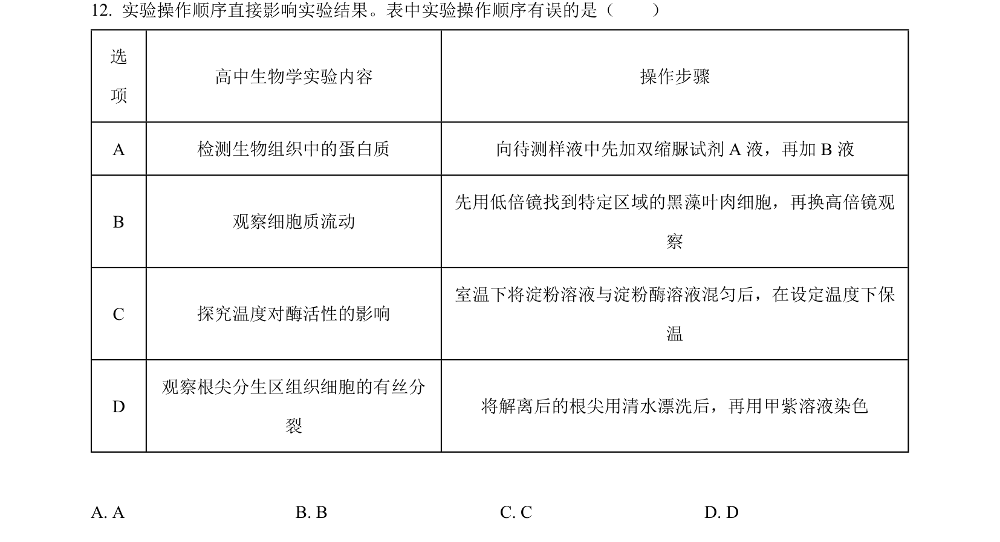
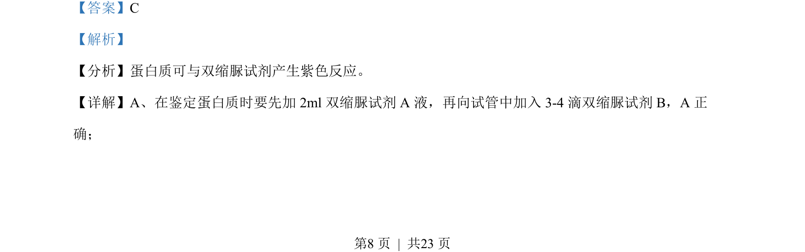
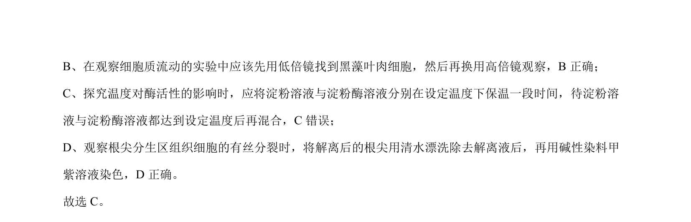

## 题面

## 摘要

本题考查不同高中生物学实验对精确定量结果的要求，区分定量与定性实验。

## 关联考点

- [[482-实验设计|实验设计]]
- [[540-定量实验|定量实验]]
- [[定性实验]]
- [[DNA粗提取与鉴定]]

## 答案与解析

> 📄 原 PDF 第 8 页：`素材/真题/北京/2008-2024·（北京）生物高考真题/2022年高考生物试卷（北京）（解析卷）.pdf`
