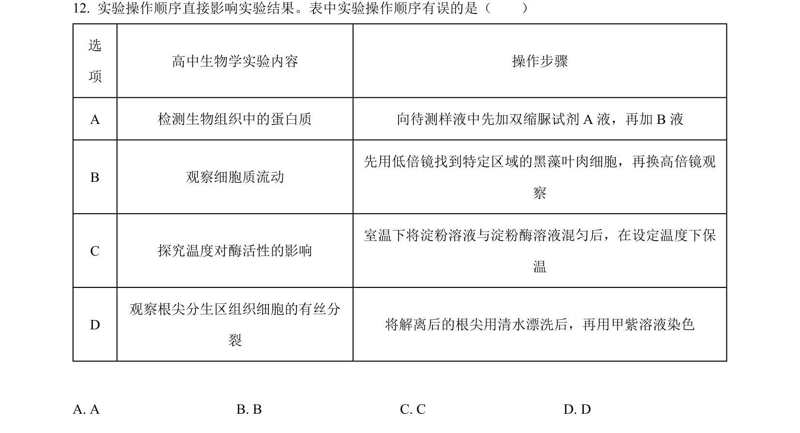
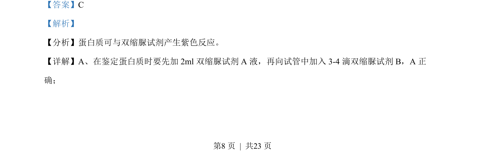
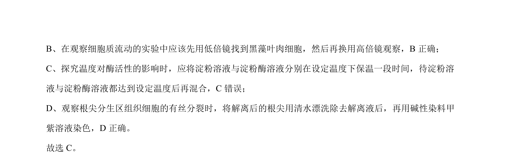

## 题面

## 摘要

本题考查不同高中生物学实验对精确定量结果的要求，区分定量与定性实验。

## 关联考点

- [[482-实验设计|实验设计]]
- [[540-定量实验|定量实验]]
- [[定性实验]]
- [[DNA粗提取与鉴定]]

## 答案与解析

> 📄 原 PDF 第 8 页：`素材/真题/北京/2008-2024·（北京）生物高考真题/2022年高考生物试卷（北京）（解析卷）.pdf`

<!-- 题干文本-start -->
## 题干文本
12. 实验操作顺序直接影响实验结果。表中实验操作顺序有误的是（　　）
选
项
高中生物学实验内容 操作步骤
A 检测生物组织中的蛋白质 向待测样液中先加双缩脲试剂 A 液，再加 B液
B 观察细胞质流动
先用低倍镜找到特定区域的黑藻叶肉细胞，再换高倍镜观
察
C 探究温度对酶活性的影响
室温下将淀粉溶液与淀粉酶溶液混匀后，在设定温度下保
温
D
观察根尖分生区组织细胞的有丝分
裂
将解离后的根尖用清水漂洗后，再用甲紫溶液染色
A. A B. B C. C D. D
<!-- 题干文本-end -->

<!-- 解析文本-start -->
## 解析文本
【答案】C
【解析】
【分析】蛋白质可与双缩脲试剂产生紫色反应。
【详解】A、在鉴定蛋白质时要先加 2ml双缩脲试剂 A 液，再向试管中加入 3-4 滴双缩脲试剂 B，A 正
确；
<!-- 解析文本-end -->
