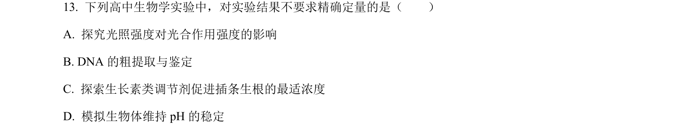
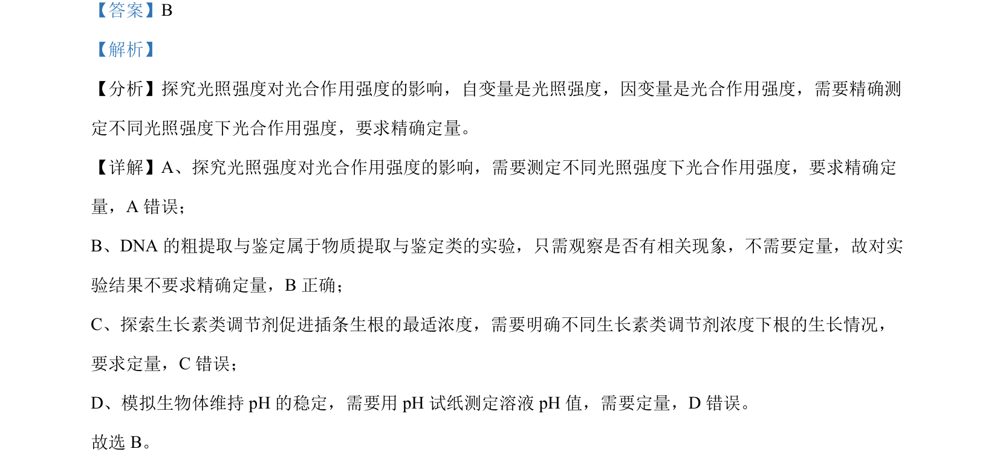

## 题面

## 摘要

有氧呼吸产生超氧化物及吸烟对血浆蛋白质氧化产物的影响分析

## 关联考点

- [[240-有氧呼吸|有氧呼吸]]
- [[904-超氧化物|超氧化物]]
- [[899-细胞损伤|细胞损伤]]
- [[666-实验分析|实验分析]]

## 答案与解析

> 📄 原 PDF 第 9 页：`素材/真题/北京/2008-2024·（北京）生物高考真题/2022年高考生物试卷（北京）（解析卷）.pdf`
