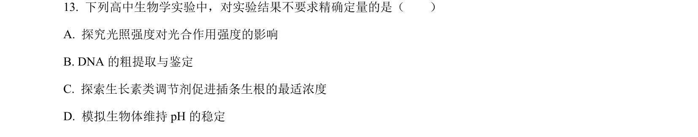
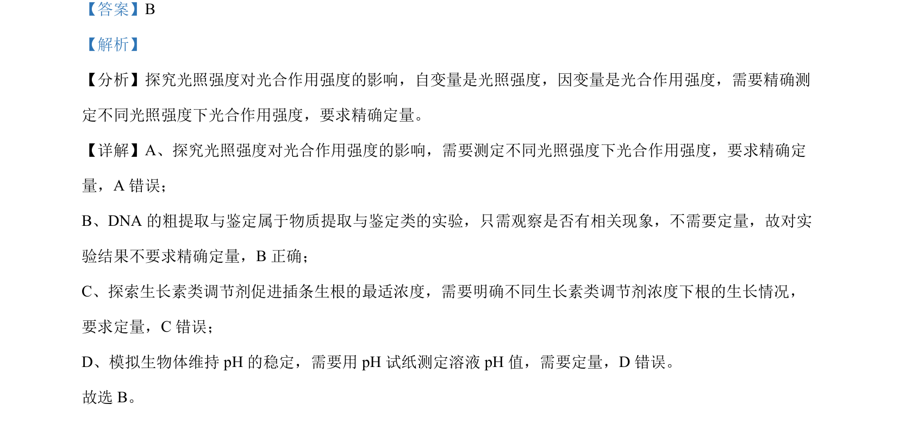

## 题面

## 摘要

有氧呼吸产生超氧化物及吸烟对血浆蛋白质氧化产物的影响分析

## 关联考点

- [[240-有氧呼吸|有氧呼吸]]
- [[904-超氧化物|超氧化物]]
- [[899-细胞损伤|细胞损伤]]
- [[666-实验分析|实验分析]]

## 答案与解析

> 📄 原 PDF 第 9 页：`素材/真题/北京/2008-2024·（北京）生物高考真题/2022年高考生物试卷（北京）（解析卷）.pdf`

<!-- 题干文本-start -->
## 题干文本
13. 下列高中生物学实验中，对实验结果不要求精确定量的是（　　）
A. 探究光照强度对光合作用强度的影响
B. DNA 的粗提取与鉴定
C. 探索生长素类调节剂促进插条生根的最适浓度
D. 模拟生物体维持 pH 的稳定
<!-- 题干文本-end -->

<!-- 解析文本-start -->
## 解析文本
【答案】B
【解析】
【分析】探究光照强度对光合作用强度的影响，自变量是光照强度，因变量是光合作用强度，需要精确测
定不同光照强度下光合作用强度，要求精确定量。
【详解】A、探究光照强度对光合作用强度的影响，需要测定不同光照强度下光合作用强度，要求精确定
量，A 错误；
B、DNA 的粗提取与鉴定属于物质提取与鉴定类的实验，只需观察是否有相关现象，不需要定量，故对实
验结果不要求精确定量，B正确；
C、探索生长素类调节剂促进插条生根的最适浓度，需要明确不同生长素类调节剂浓度下根的生长情况，
要求定量，C错误；
D、模拟生物体维持 pH 的稳定，需要用 pH 试纸测定溶液 pH 值，需要定量，D 错误。
故选 B。
<!-- 解析文本-end -->
