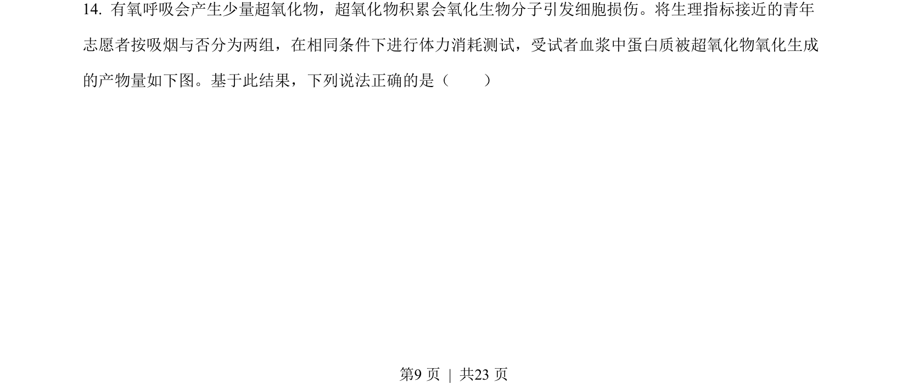
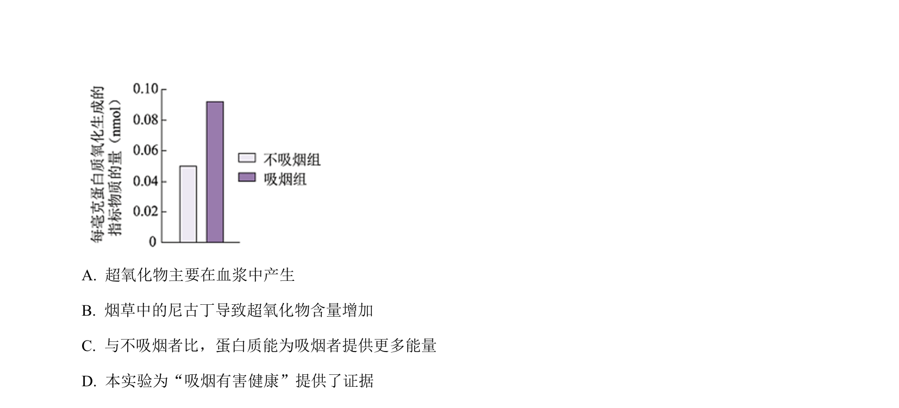
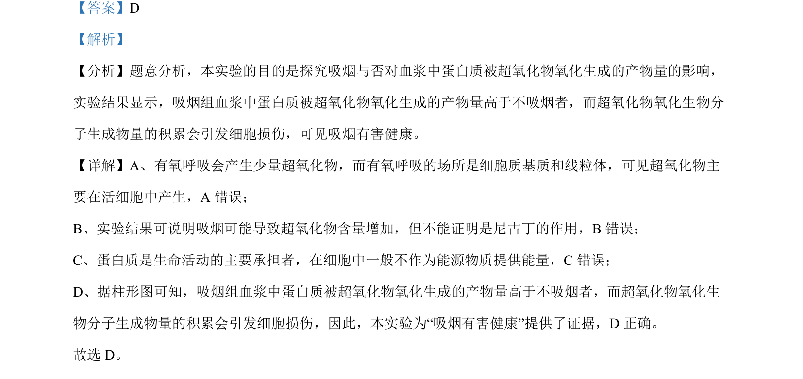

## 题面

## 摘要

本题通过实验探究吸烟对血浆蛋白质被超氧化物氧化的影响，证明吸烟有害健康。

## 关联考点

- [[240-有氧呼吸|有氧呼吸]]
- [[904-超氧化物|超氧化物]]
- [[696-蛋白质功能|蛋白质功能]]
- [[899-细胞损伤|细胞损伤]]

## 答案与解析

> 📄 原 PDF 第 9 页：`素材/真题/北京/2008-2024·（北京）生物高考真题/2022年高考生物试卷（北京）（解析卷）.pdf`

<!-- 题干文本-start -->
## 题干文本
14. 有氧呼吸会产生少量超氧化物，超氧化物积累会氧化生物分子引发细胞损伤。将生理指标接近的青年
志愿者按吸烟与否分为两组，在相同条件下进行体力消耗测试，受试者血浆中蛋白质被超氧化物氧化生成
的产物量如下图。基于此结果，下列说法正确的是（　　）
<!-- 题干文本-end -->

<!-- 解析文本-start -->
## 解析文本

<!-- 解析文本-end -->
