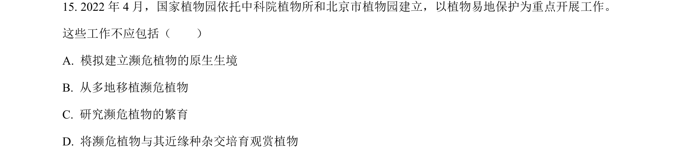
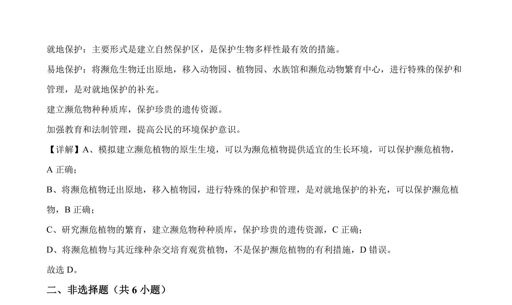

## 题面

## 摘要

该题考查生物多样性保护措施，判断哪个措施不利于保护濒危植物。

## 关联考点

- [[401-生物多样性保护|生物多样性保护]]
- [[395-就地保护|就地保护]]
- [[397-易地保护|易地保护]]
- [[种质库]]

## 答案与解析

> 📄 原 PDF 第 10 页：`素材/真题/北京/2008-2024·（北京）生物高考真题/2022年高考生物试卷（北京）（解析卷）.pdf`
