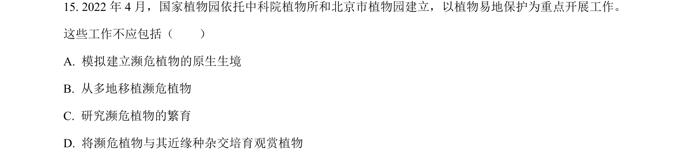
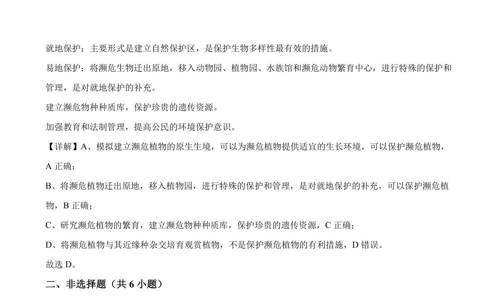

## 题面

## 摘要

该题考查生物多样性保护措施，判断哪个措施不利于保护濒危植物。

## 关联考点

- [[401-生物多样性保护|生物多样性保护]]
- [[395-就地保护|就地保护]]
- [[397-易地保护|易地保护]]
- [[种质库]]

## 答案与解析

> 📄 原 PDF 第 10 页：`素材/真题/北京/2008-2024·（北京）生物高考真题/2022年高考生物试卷（北京）（解析卷）.pdf`

<!-- 题干文本-start -->
## 题干文本
15. 2022 年 4 月，国家植物园依托中科院植物所和北京市植物园建立，以植物易地保护为重点开展工作。
这些工作不应包括（　　）
A. 模拟建立濒危植物的原生生境
B. 从多地移植濒危植物
C. 研究濒危植物的繁育
D. 将濒危植物与其近缘种杂交培育观赏植物
<!-- 题干文本-end -->

<!-- 解析文本-start -->
## 解析文本
【答案】D
【解析】
【分析】生物多样性的保护措施：
<!-- 解析文本-end -->
