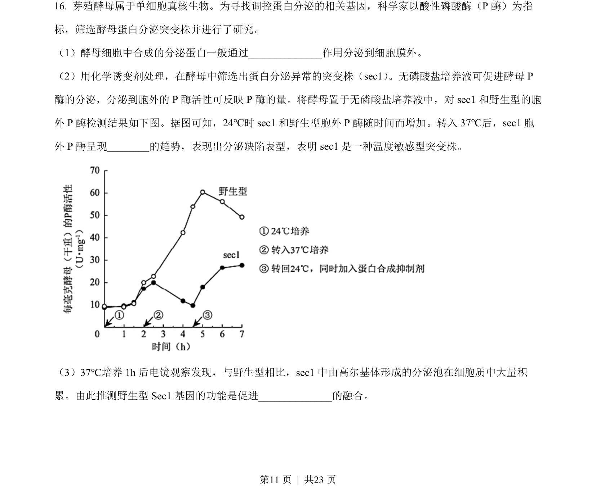
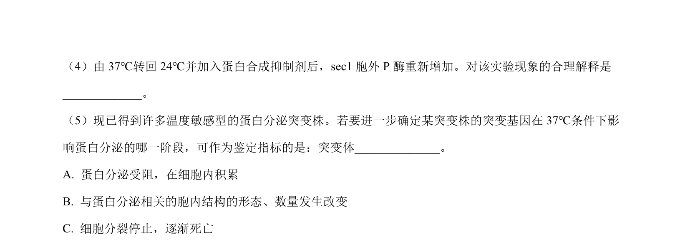
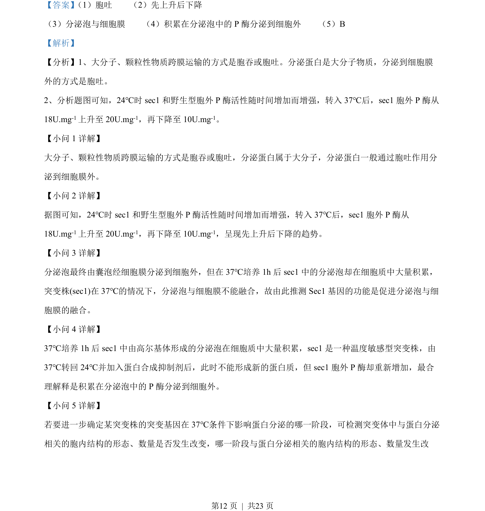

## 题面

## 摘要

本题通过分泌蛋白运输、温度敏感突变体分析与干旱诱导ABA合成实验，综合考查物质跨膜运输、基因功能、植物激素调控及实验设计能力。

## 关联考点

- [[259-胞吐|胞吐]]
- [[分泌蛋白]]
- [[301-基因突变|基因突变]]
- [[350-脱落酸|脱落酸]]
- [[345-植物激素|植物激素]]

## 答案与解析

> 📄 原 PDF 第 11 页：`素材/真题/北京/2008-2024·（北京）生物高考真题/2022年高考生物试卷（北京）（解析卷）.pdf`
