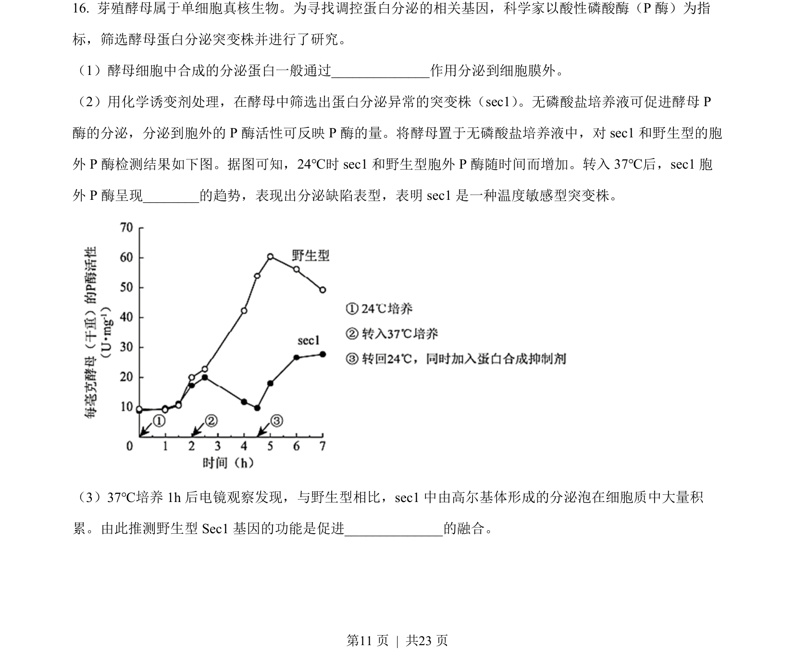
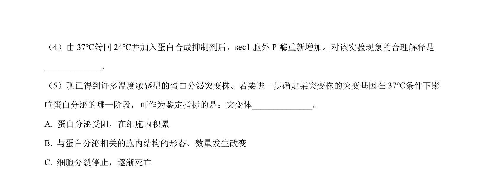
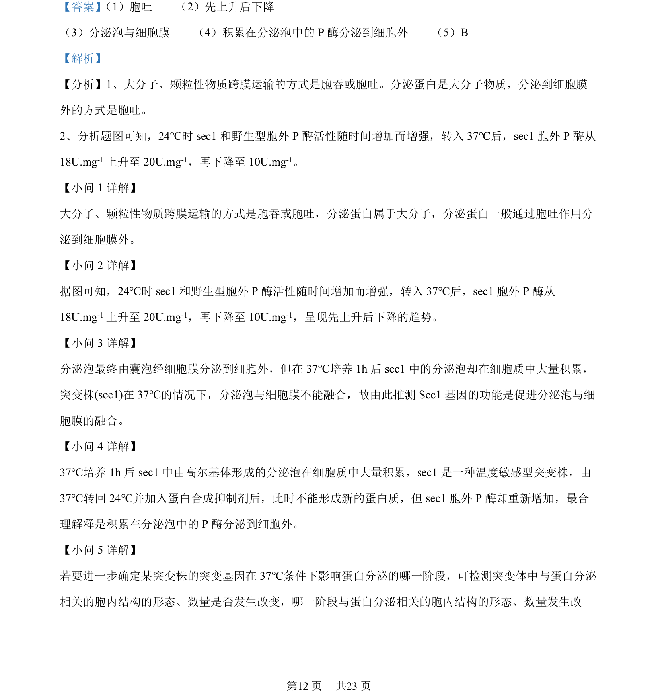

## 题面

## 摘要

本题通过分泌蛋白运输、温度敏感突变体分析与干旱诱导ABA合成实验，综合考查物质跨膜运输、基因功能、植物激素调控及实验设计能力。

## 关联考点

- [[259-胞吐|胞吐]]
- [[分泌蛋白]]
- [[301-基因突变|基因突变]]
- [[350-脱落酸|脱落酸]]
- [[345-植物激素|植物激素]]

## 答案与解析

> 📄 原 PDF 第 11 页：`素材/真题/北京/2008-2024·（北京）生物高考真题/2022年高考生物试卷（北京）（解析卷）.pdf`

<!-- 题干文本-start -->
## 题干文本
16. 芽殖酵母属于单细胞真核生物。为寻找调控蛋白分泌的相关基因，科学家以酸性磷酸酶（P 酶）为指
标，筛选酵母蛋白分泌突变株并进行了研究。
（1）酵母细胞中合成的分泌蛋白一般通过______________作用分泌到细胞膜外。
（2）用化学诱变剂处理，在酵母中筛选出蛋白分泌异常的突变株（sec1） 。无磷酸盐培养液可促进酵母P
酶的分泌，分泌到胞外的 P 酶活性可反映 P 酶的量。将酵母置于无磷酸盐培养液中，对 sec1和野生型的胞
外 P 酶检测结果如下图。据图可知，24℃时 sec1和野生型胞外 P 酶随时间而增加。转入 37℃后，sec1胞
外 P 酶呈现________的趋势，表现出分泌缺陷表型，表明 sec1是一种温度敏感型突变株。
（3）37℃培养 1h 后电镜观察发现，与野生型相比，sec1中由高尔基体形成的分泌泡在细胞质中大量积
累。由此推测野生型 Sec1基因的功能是促进______________的融合。
<!-- 题干文本-end -->

<!-- 解析文本-start -->
## 解析文本

<!-- 解析文本-end -->
