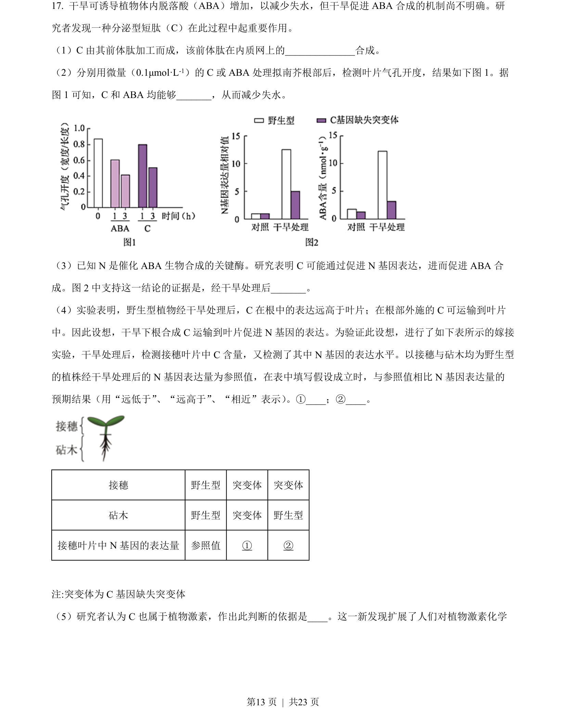
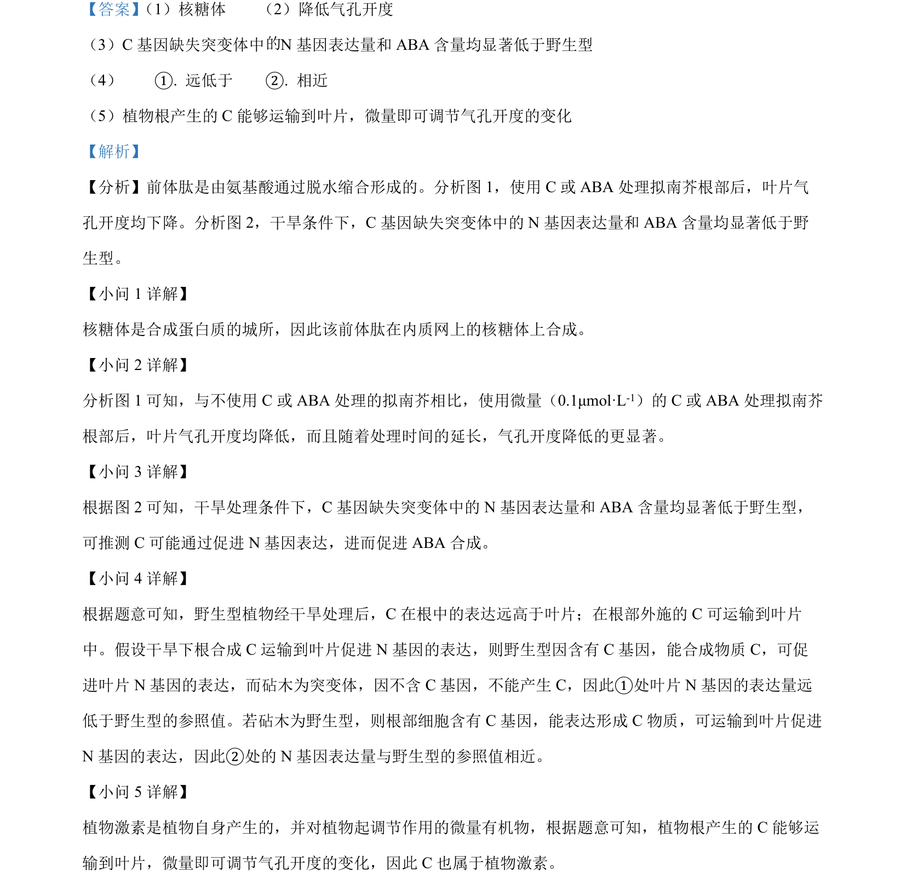

## 题面

## 摘要

本题以拟南芥C物质调节气孔开度和番茄果实成熟机制为背景，考查基因表达、遗传规律和表观遗传。

## 关联考点

- [[477-基因分离定律|基因分离定律]]
- [[272-自由组合定律|自由组合定律]]
- [[581-基因表达调控|基因表达调控]]
- [[525-DNA甲基化|DNA甲基化]]
- [[345-植物激素|植物激素]]

## 答案与解析

> 📄 原 PDF 第 13 页：`素材/真题/北京/2008-2024·（北京）生物高考真题/2022年高考生物试卷（北京）（解析卷）.pdf`
