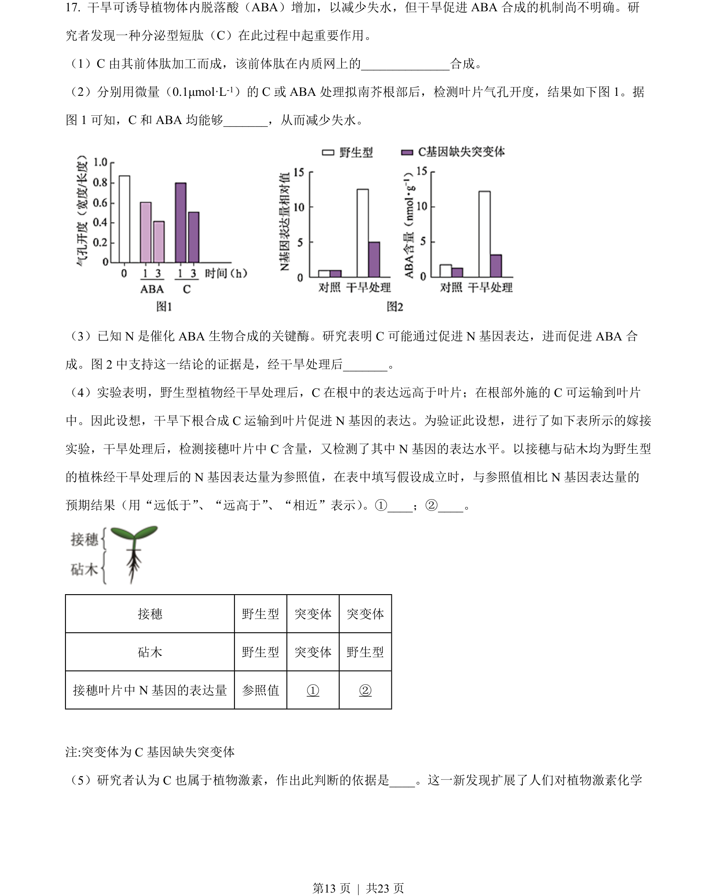
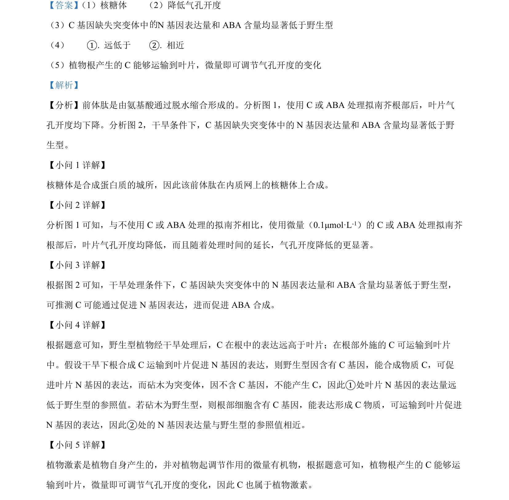

## 题面

## 摘要

本题以拟南芥C物质调节气孔开度和番茄果实成熟机制为背景，考查基因表达、遗传规律和表观遗传。

## 关联考点

- [[477-基因分离定律|基因分离定律]]
- [[272-自由组合定律|自由组合定律]]
- [[581-基因表达调控|基因表达调控]]
- [[525-DNA甲基化|DNA甲基化]]
- [[345-植物激素|植物激素]]

## 答案与解析

> 📄 原 PDF 第 13 页：`素材/真题/北京/2008-2024·（北京）生物高考真题/2022年高考生物试卷（北京）（解析卷）.pdf`

<!-- 题干文本-start -->
## 题干文本
17. 干旱可诱导植物体内脱落酸（ABA）增加，以减少失水，但干旱促进 ABA 合成的机制尚不明确。研
究者发现一种分泌型短肽（C）在此过程中起重要作用。
（1）C由其前体肽加工而成，该前体肽在内质网上的______________合成。
（2）分别用微量（0.1μmol·L-1）的 C或 ABA 处理拟南芥根部后，检测叶片气孔开度，结果如下图 1。据
图 1 可知，C和 ABA 均能够_______，从而减少失水。
（3）已知 N 是催化 ABA 生物合成的关键酶。研究表明 C可能通过促进 N 基因表达，进而促进 ABA 合
成。图 2 中支持这一结论的证据是，经干旱处理后_______。
（4）实验表明，野生型植物经干旱处理后，C在根中的表达远高于叶片；在根部外施的 C可运输到叶片
中。因此设想，干旱下根合成 C运输到叶片促进 N 基因的表达。为验证此设想，进行了如下表所示的嫁接
实验，干旱处理后，检测接穗叶片中 C含量，又检测了其中 N 基因的表达水平。以接穗与砧木均为野生型
的植株经干旱处理后的 N 基因表达量为参照值，在表中填写假设成立时，与参照值相比 N 基因表达量的
预期结果（用“远低于”、“远高于”、“相近”表示） 。①____；②____。
接穗 野生型 突变体 突变体
砧木 野生型 突变体 野生型
接穗叶片中 N 基因的表达量 参照值 ① ②
注:突变体为 C基因缺失突变体
（5）研究者认为 C也属于植物激素，作出此判断的依据是____。这一新发现扩展了人们对植物激素化学
<!-- 题干文本-end -->

<!-- 解析文本-start -->
## 解析文本

<!-- 解析文本-end -->
