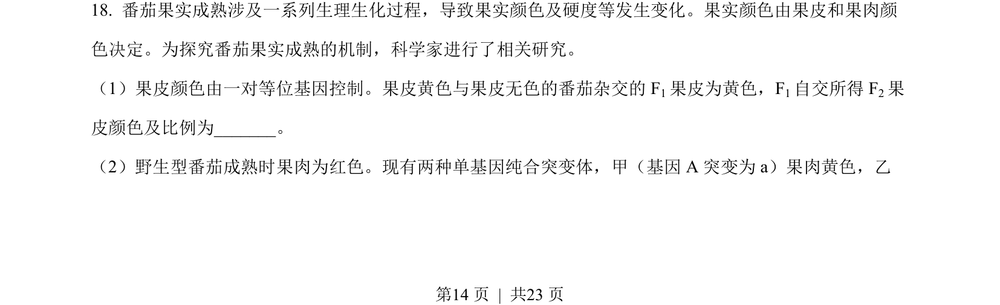
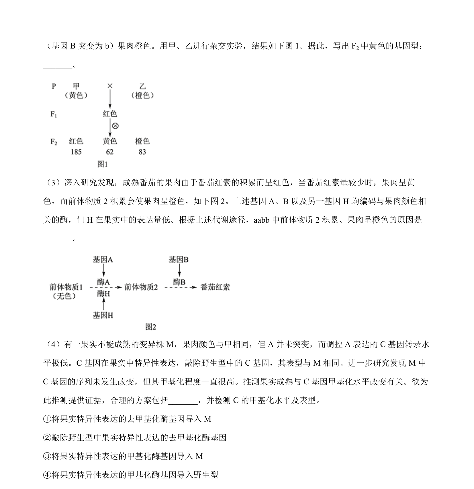
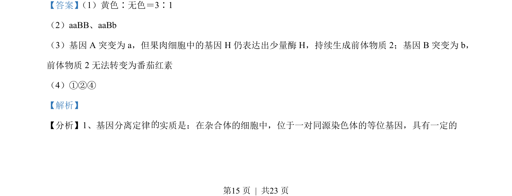
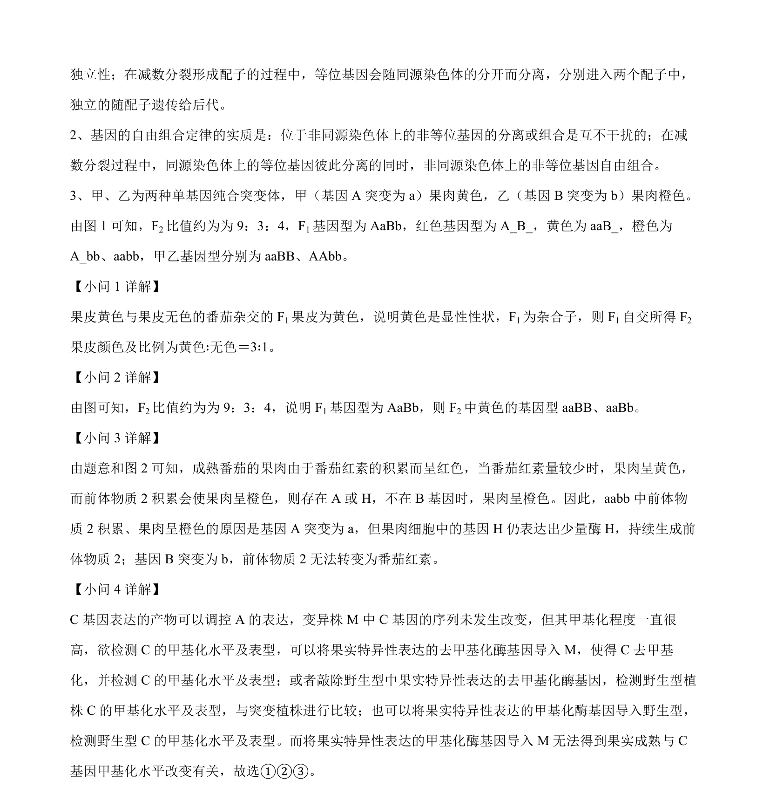

## 题面

## 摘要

本题以番茄果肉颜色遗传和蚜虫适应策略为背景，综合考查遗传规律、基因互作与表观遗传及生态系统结构与功能。

## 关联考点

- [[266-分离定律|基因的分离定律]]
- [[272-自由组合定律|基因的自由组合定律]]
- [[573-基因互作|基因互作]]
- [[706-表观遗传|表观遗传]]
- [[生态系统的组成]]
- [[383-生态系统物质循环|物质循环]]

## 答案与解析

> 📄 原 PDF 第 14 页：`素材/真题/北京/2008-2024·（北京）生物高考真题/2022年高考生物试卷（北京）（解析卷）.pdf`
