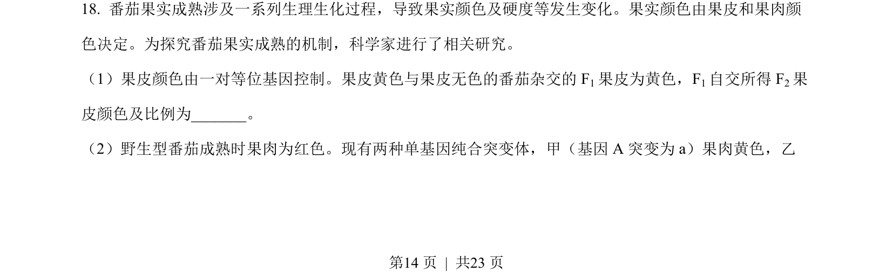
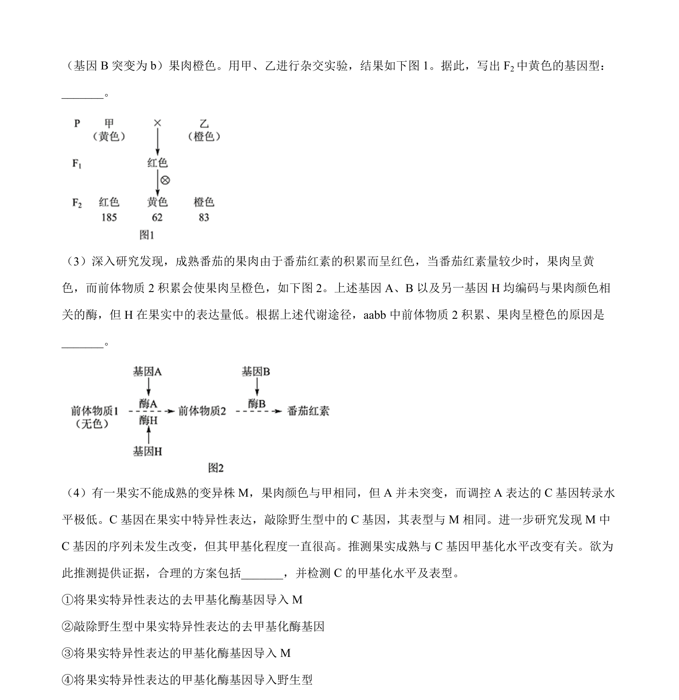
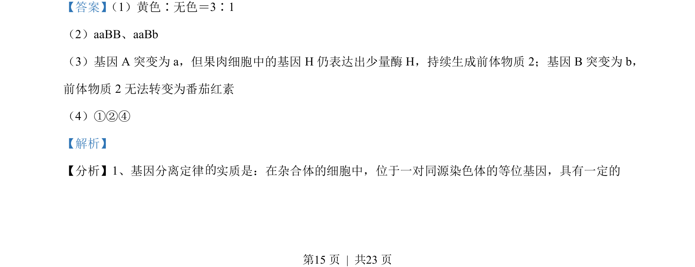
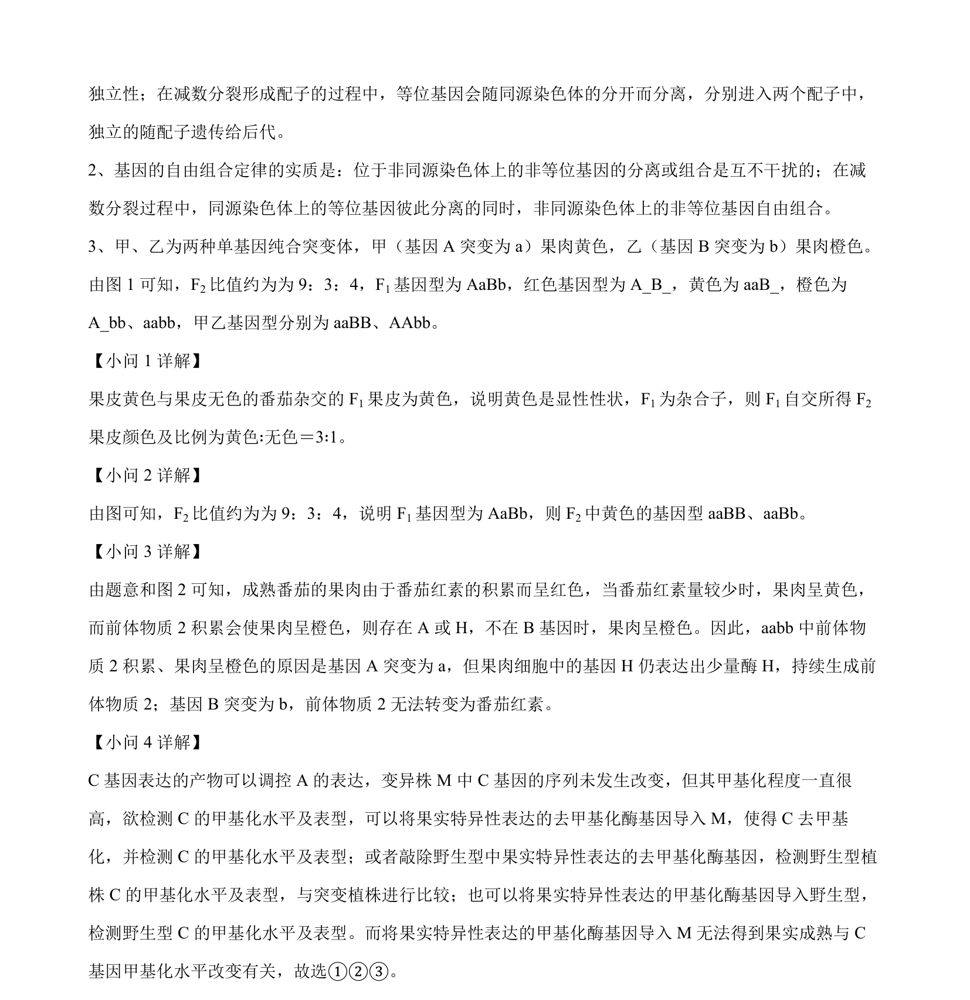

## 题面

## 摘要

本题以番茄果肉颜色遗传和蚜虫适应策略为背景，综合考查遗传规律、基因互作与表观遗传及生态系统结构与功能。

## 关联考点

- [[266-分离定律|基因的分离定律]]
- [[272-自由组合定律|基因的自由组合定律]]
- [[573-基因互作|基因互作]]
- [[706-表观遗传|表观遗传]]
- [[生态系统的组成]]
- [[383-生态系统物质循环|物质循环]]

## 答案与解析

> 📄 原 PDF 第 14 页：`素材/真题/北京/2008-2024·（北京）生物高考真题/2022年高考生物试卷（北京）（解析卷）.pdf`

<!-- 题干文本-start -->
## 题干文本
18. 番茄果实成熟涉及一系列生理生化过程，导致果实颜色及硬度等发生变化。果实颜色由果皮和果肉颜
色决定。为探究番茄果实成熟的机制，科学家进行了相关研究。
（1）果皮颜色由一对等位基因控制。果皮黄色与果皮无色的番茄杂交的 F1果皮为黄色，F1自交所得 F2果
皮颜色及比例为_______。
（2）野生型番茄成熟时果肉为红色。现有两种单基因纯合突变体，甲（基因 A 突变为 a）果肉黄色，乙
的
<!-- 题干文本-end -->

<!-- 解析文本-start -->
## 解析文本

<!-- 解析文本-end -->
