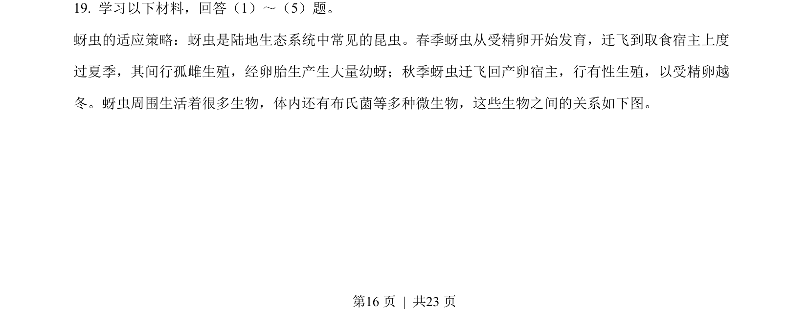
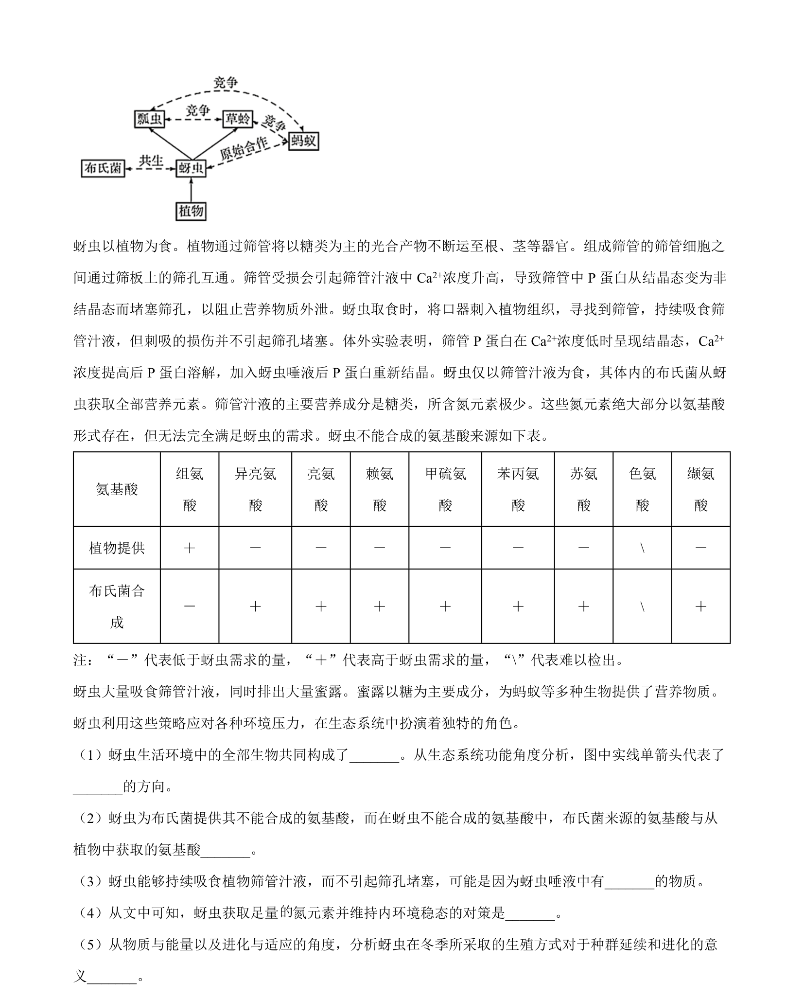
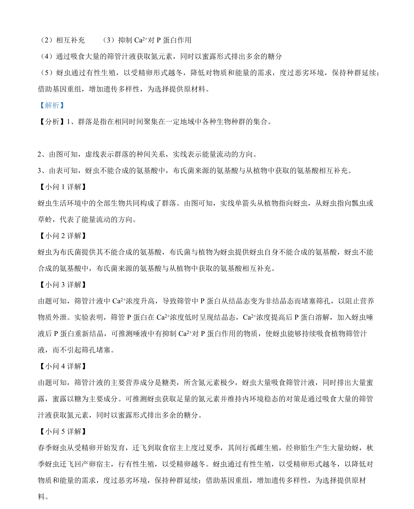

## 题面

## 摘要

群落和种间关系分析，蚜虫与布氏菌的互利共生，能量流动方向判断。

## 关联考点

- [[374-群落|群落]]
- [[385-生态系统能量流动|能量流动]]
- [[022-生物因素|种间关系]]
- [[适应性进化]]

## 答案与解析

> 📄 原 PDF 第 16 页：`素材/真题/北京/2008-2024·（北京）生物高考真题/2022年高考生物试卷（北京）（解析卷）.pdf`
