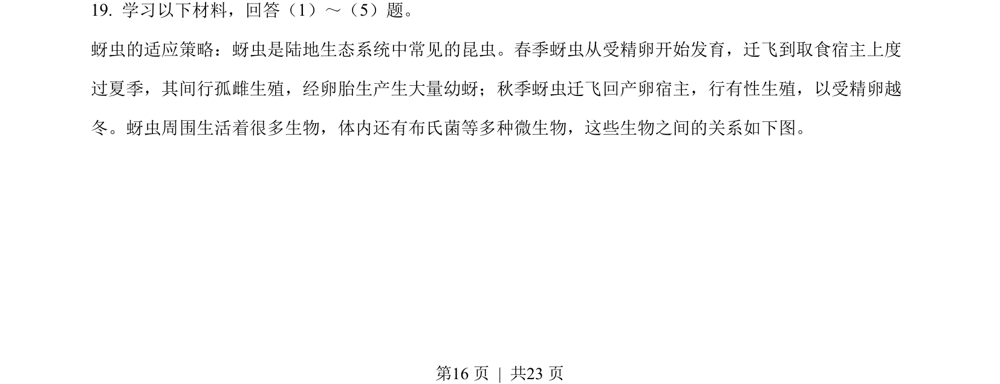
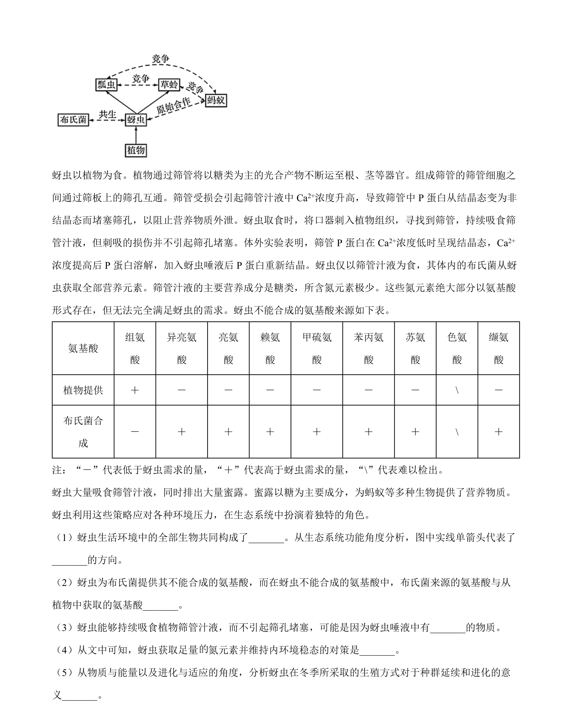
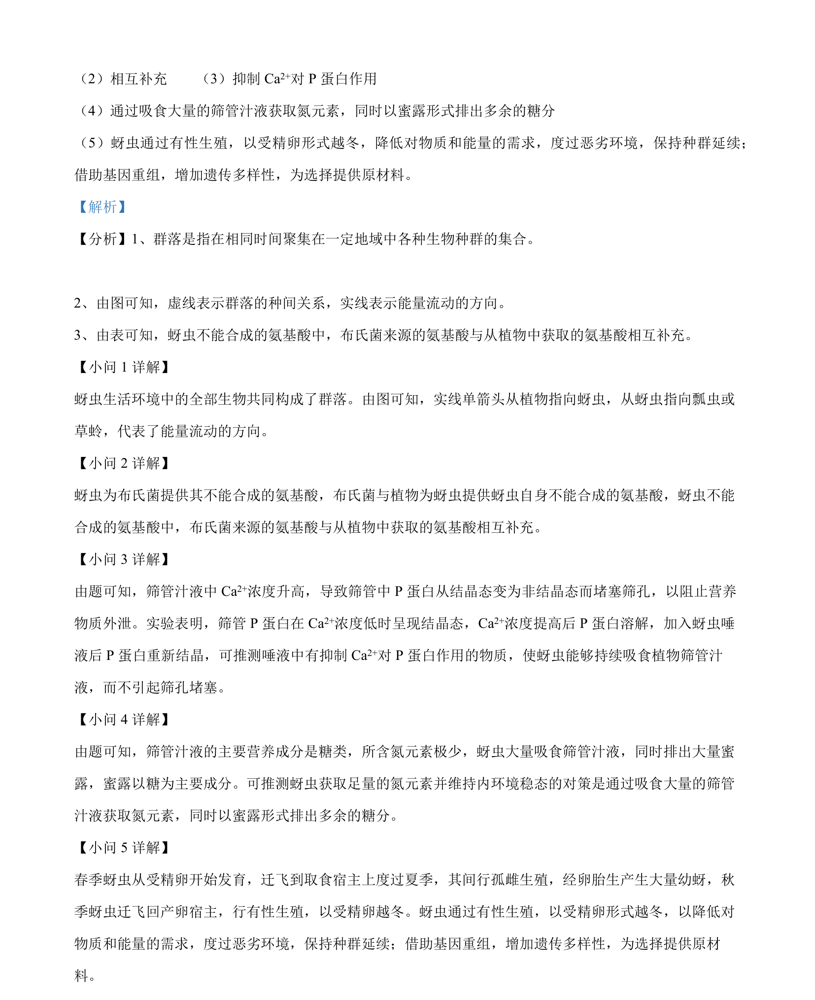

## 题面

## 摘要

群落和种间关系分析，蚜虫与布氏菌的互利共生，能量流动方向判断。

## 关联考点

- [[374-群落|群落]]
- [[385-生态系统能量流动|能量流动]]
- [[022-生物因素|种间关系]]
- [[适应性进化]]

## 答案与解析

> 📄 原 PDF 第 16 页：`素材/真题/北京/2008-2024·（北京）生物高考真题/2022年高考生物试卷（北京）（解析卷）.pdf`

<!-- 题干文本-start -->
## 题干文本
19. 学习以下材料，回答（1）～（5）题。
蚜虫的适应策略：蚜虫是陆地生态系统中常见的昆虫。春季蚜虫从受精卵开始发育，迁飞到取食宿主上度
过夏季，其间行孤雌生殖，经卵胎生产生大量幼蚜；秋季蚜虫迁飞回产卵宿主，行有性生殖，以受精卵越
冬。蚜虫周围生活着很多生物，体内还有布氏菌等多种微生物，这些生物之间的关系如下图。
<!-- 题干文本-end -->

<!-- 解析文本-start -->
## 解析文本

<!-- 解析文本-end -->
