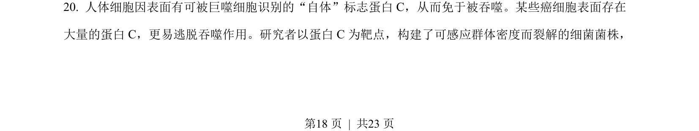
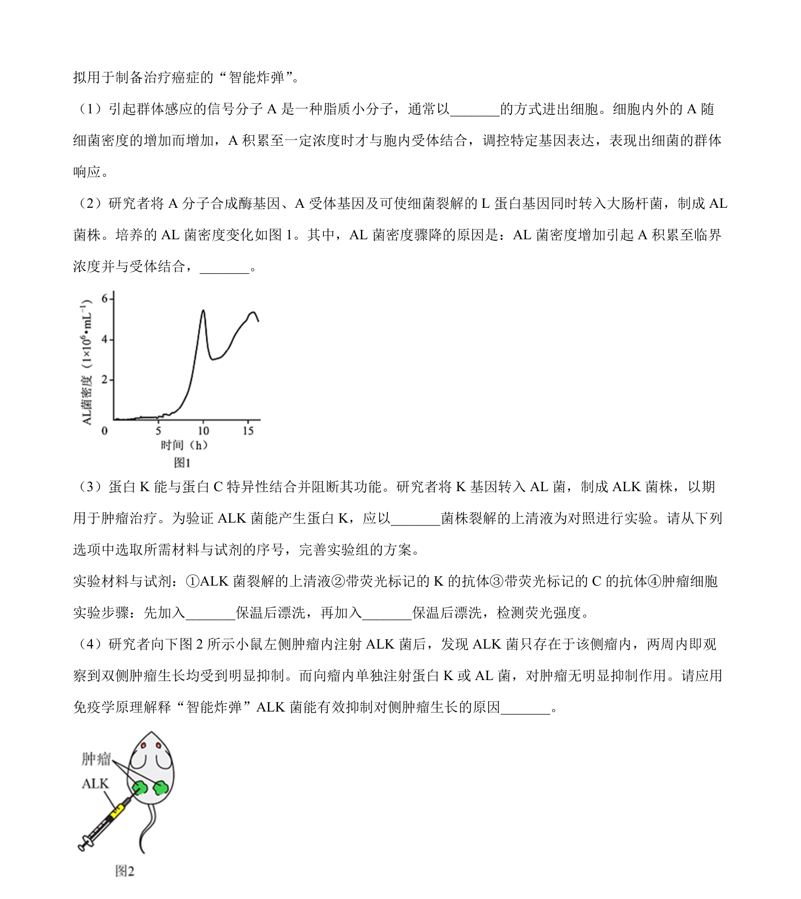
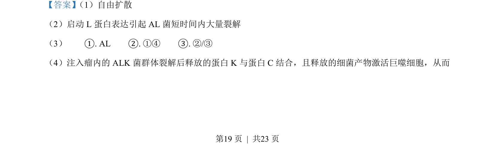
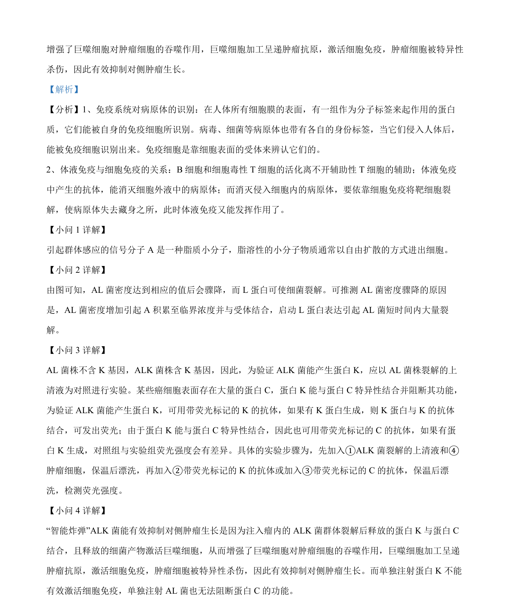

## 题面

## 摘要

该题考查利用转基因斑马鱼监测水中雌激素污染物的技术，涉及基因表达载体导入、启动子选择及不育鱼制备。

## 关联考点

- [[417-转基因动物|转基因动物]]
- [[750-启动子|启动子]]
- [[581-基因表达调控|基因表达调控]]
- [[生态监测]]

## 答案与解析

> 📄 原 PDF 第 18 页：`素材/真题/北京/2008-2024·（北京）生物高考真题/2022年高考生物试卷（北京）（解析卷）.pdf`
