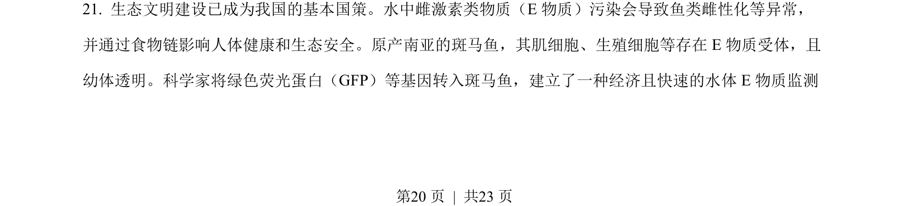
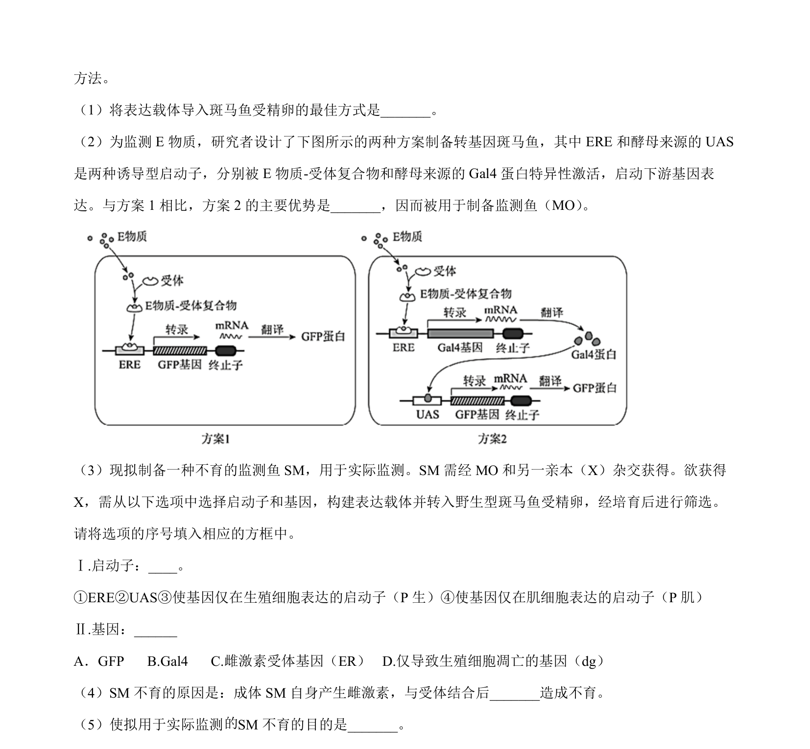
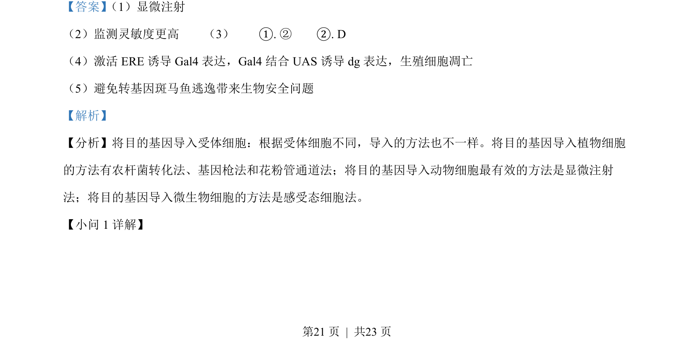
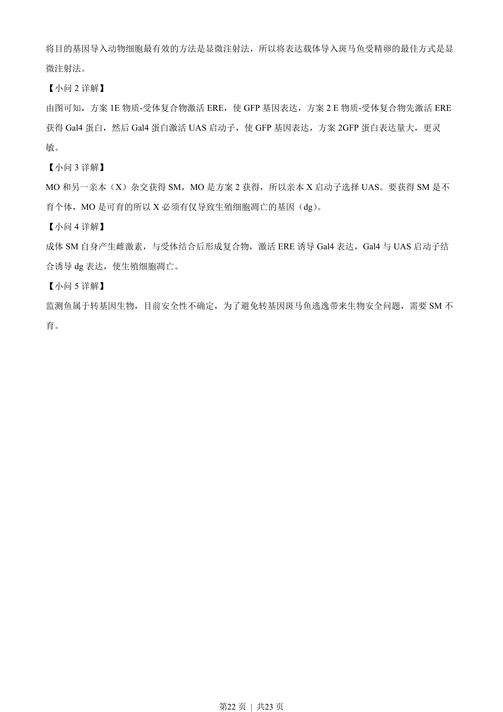

## 题面

## 摘要

本题考查基因工程中目的基因导入方法与转基因斑马鱼的基因表达调控及生物安全性。

## 关联考点

- [[显微注射法]]
- [[907-基因表达载体|基因表达载体]]
- [[启动子-激活蛋白调控]]
- [[转基因生物安全性]]

## 答案与解析

> 📄 原 PDF 第 20 页：`素材/真题/北京/2008-2024·（北京）生物高考真题/2022年高考生物试卷（北京）（解析卷）.pdf`
