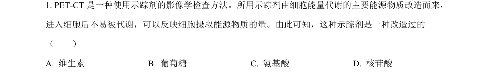
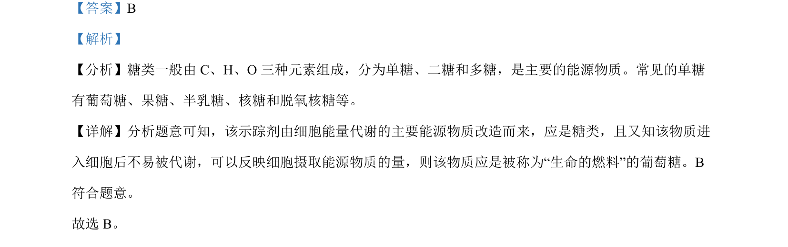

## 题面

## 摘要

糖类为细胞主要能源，改造示踪剂应为不易代谢的葡萄糖

## 关联考点

- [[130-糖类|糖类]]
- [[900-能源物质|能源物质]]
- [[516-葡萄糖|葡萄糖]]

## 答案与解析

> 📄 原 PDF 第 1 页：`素材/真题/北京/2008-2024·（北京）生物高考真题/2023年高考生物试卷（北京）（解析卷）.pdf`

<!-- 题干文本-start -->
## 题干文本
1. PET-CT是一种使用示踪剂的影像学检查方法。所用示踪剂由细胞能量代谢的主要能源物质改造而来，
进入细胞后不易被代谢，可以反映细胞摄取能源物质的量。由此可知，这种示踪剂是一种改造过的
（　　）
A. 维生素 B. 葡萄糖 C. 氨基酸 D. 核苷酸
<!-- 题干文本-end -->

<!-- 解析文本-start -->
## 解析文本
【答案】B
【解析】
【分析】糖类一般由 C、H、O 三种元素组成，分为单糖、二糖和多糖，是主要的能源物质。常见的单糖
有葡萄糖、果糖、半乳糖、核糖和脱氧核糖等。
【详解】分析题意可知，该示踪剂由细胞能量代谢的主要能源物质改造而来，应是糖类，且又知该物质进
入细胞后不易被代谢，可以反映细胞摄取能源物质的量，则该物质应是被称为“生命的燃料”的葡萄糖。B
符合题意。
故选 B。
<!-- 解析文本-end -->
