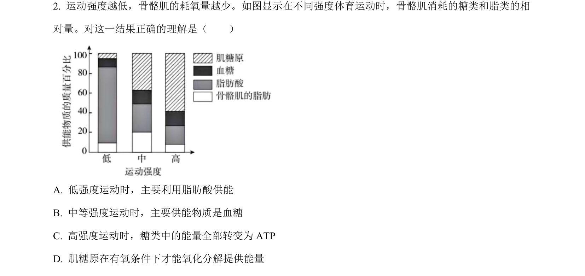
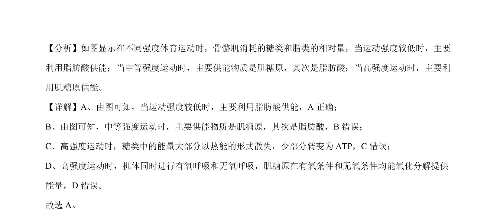

## 题面

## 摘要

不同运动强度下骨骼肌供能物质的变化

## 关联考点

- [[241-细胞呼吸|细胞呼吸]]
- [[900-能源物质|能源物质]]
- [[糖类与脂类代谢]]

## 答案与解析

> 📄 原 PDF 第 1 页：`素材/真题/北京/2008-2024·（北京）生物高考真题/2023年高考生物试卷（北京）（解析卷）.pdf`

<!-- 题干文本-start -->
## 题干文本
2. 运动强度越低，骨骼肌的耗氧量越少。如图显示在不同强度体育运动时，骨骼肌消耗的糖类和脂类的相
对量。对这一结果正确的理解是（　　）
A. 低强度运动时，主要利用脂肪酸供能
B. 中等强度运动时，主要供能物质是血糖
C. 高强度运动时，糖类中的能量全部转变为 ATP
D. 肌糖原在有氧条件下才能氧化分解提供能量
<!-- 题干文本-end -->

<!-- 解析文本-start -->
## 解析文本
【答案】A
【解析】
<!-- 解析文本-end -->
