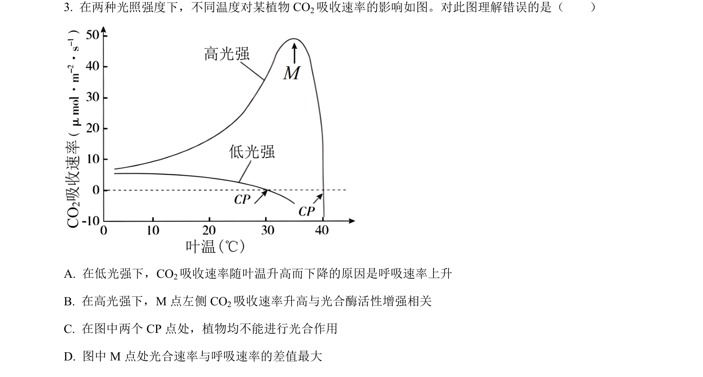
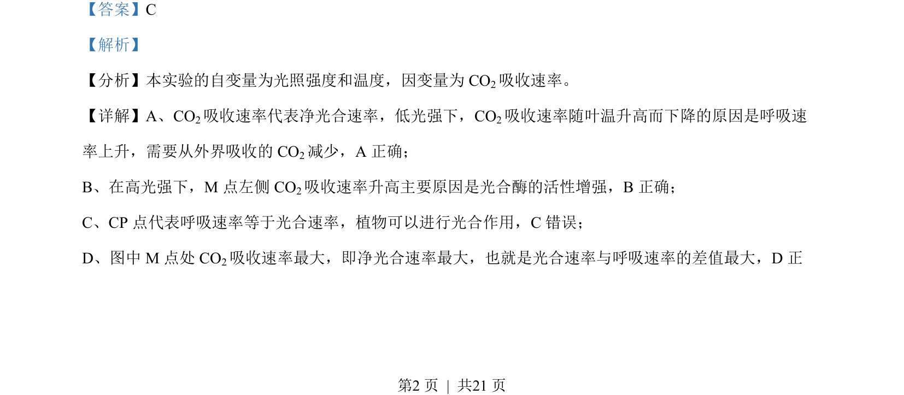
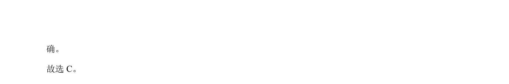

## 题面

## 摘要

考查不同光照和温度下CO2吸收速率变化，分析净光合速率与呼吸速率关系

## 关联考点

- [[033-光合作用|光合作用]]
- [[031-呼吸作用|呼吸作用]]
- [[552-净光合速率|净光合速率]]
- [[035-温度|温度]]

## 答案与解析

> 📄 原 PDF 第 2 页：`素材/真题/北京/2008-2024·（北京）生物高考真题/2023年高考生物试卷（北京）（解析卷）.pdf`
