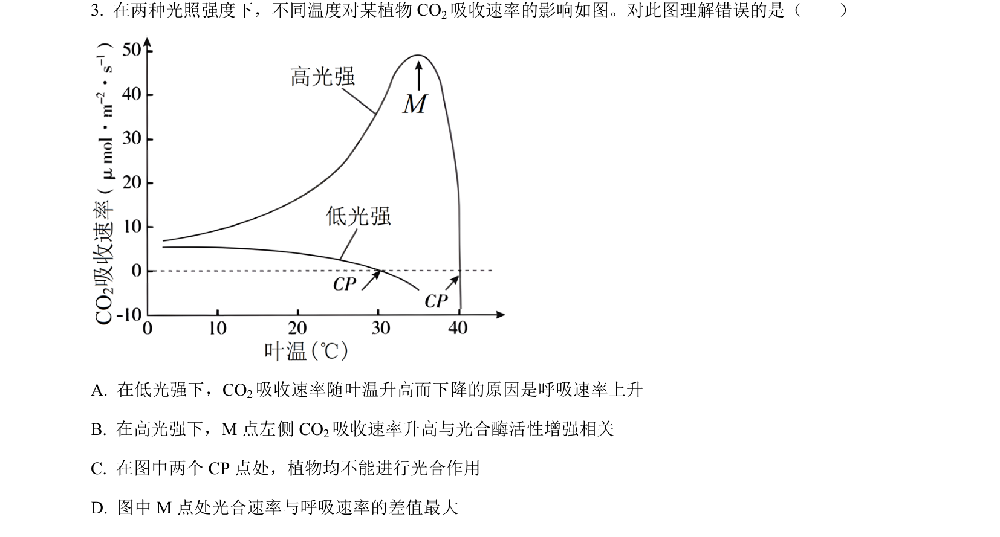
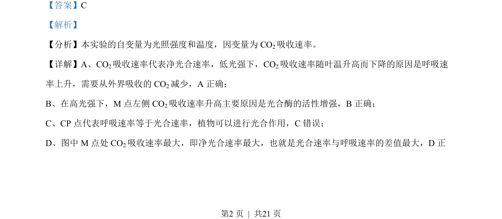
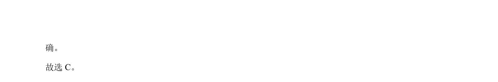

## 题面

## 摘要

考查不同光照和温度下CO2吸收速率变化，分析净光合速率与呼吸速率关系

## 关联考点

- [[033-光合作用|光合作用]]
- [[031-呼吸作用|呼吸作用]]
- [[552-净光合速率|净光合速率]]
- [[035-温度|温度]]

## 答案与解析

> 📄 原 PDF 第 2 页：`素材/真题/北京/2008-2024·（北京）生物高考真题/2023年高考生物试卷（北京）（解析卷）.pdf`

<!-- 题干文本-start -->
## 题干文本
3. 在两种光照强度下，不同温度对某植物 CO2吸收速率的影响如图。对此图理解错误的是（　　）
    
A. 在低光强下，CO2吸收速率随叶温升高而下降的原因是呼吸速率上升
B. 在高光强下，M 点左侧 CO2吸收速率升高与光合酶活性增强相关
C. 在图中两个 CP 点处，植物均不能进行光合作用
D. 图中 M 点处光合速率与呼吸速率的差值最大
<!-- 题干文本-end -->

<!-- 解析文本-start -->
## 解析文本
【答案】C
【解析】
【分析】本实验的自变量为光照强度和温度，因变量为 CO2吸收速率。
【详解】A、CO2吸收速率代表净光合速率，低光强下，CO2吸收速率随叶温升高而下降的原因是呼吸速
率上升，需要从外界吸收的 CO2减少，A 正确；
B、在高光强下，M 点左侧 CO2吸收速率升高主要原因是光合酶的活性增强，B正确；
C、CP 点代表呼吸速率等于光合速率，植物可以进行光合作用，C错误；
D、图中 M 点处 CO2吸收速率最大，即净光合速率最大，也就是光合速率与呼吸速率的差值最大，D 正
<!-- 解析文本-end -->
