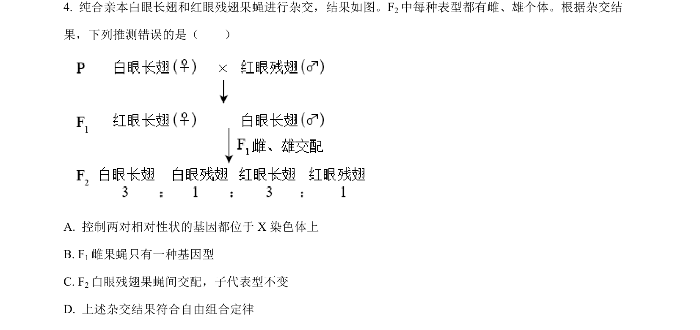
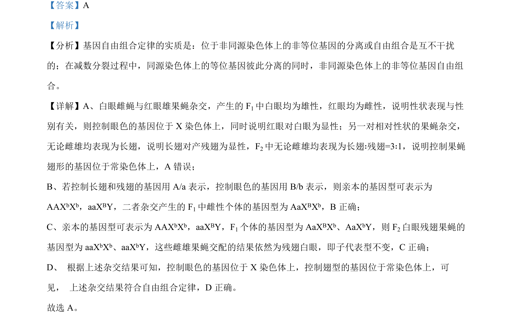

## 题面

## 摘要

根据子代表型推测基因在常染色体或X染色体上，验证自由组合定律并判断基因型。

## 关联考点

- [[580-基因自由组合定律|基因自由组合定律]]
- [[276-伴性遗传|伴性遗传]]
- [[477-基因分离定律|基因分离定律]]
- [[显隐性关系]]

## 答案与解析

> 📄 原 PDF 第 3 页：`素材/真题/北京/2008-2024·（北京）生物高考真题/2023年高考生物试卷（北京）（解析卷）.pdf`
