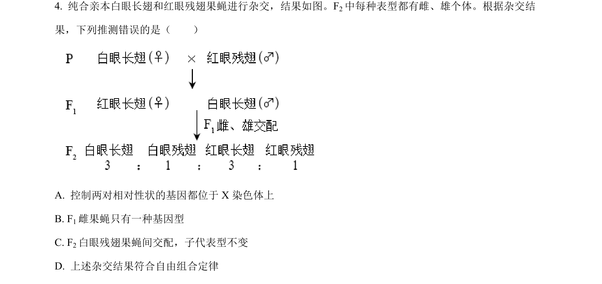
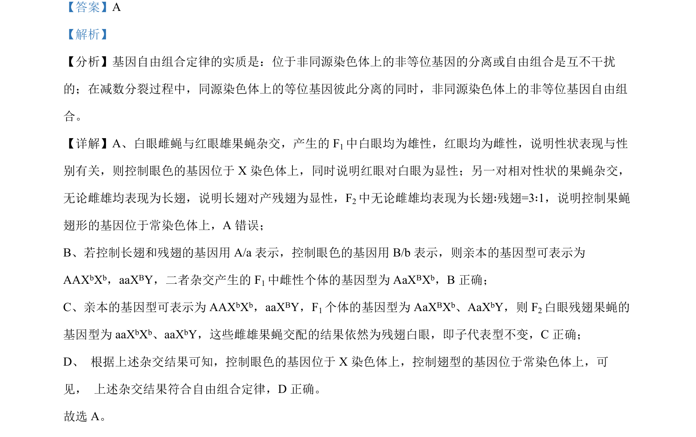

## 题面

## 摘要

根据子代表型推测基因在常染色体或X染色体上，验证自由组合定律并判断基因型。

## 关联考点

- [[580-基因自由组合定律|基因自由组合定律]]
- [[276-伴性遗传|伴性遗传]]
- [[477-基因分离定律|基因分离定律]]
- [[891-显隐性关系|显隐性关系]]

## 答案与解析

> 📄 原 PDF 第 3 页：`素材/真题/北京/2008-2024·（北京）生物高考真题/2023年高考生物试卷（北京）（解析卷）.pdf`

<!-- 题干文本-start -->
## 题干文本
4. 纯合亲本白眼长翅和红眼残翅果蝇进行杂交，结果如图。F2中每种表型都有雌、雄个体。根据杂交结
果，下列推测错误的是（　　）
  
A. 控制两对相对性状的基因都位于 X 染色体上
B. F1雌果蝇只有一种基因型
C. F2白眼残翅果蝇间交配，子代表型不变
D. 上述杂交结果符合自由组合定律
<!-- 题干文本-end -->

<!-- 解析文本-start -->
## 解析文本
【答案】A
【解析】
【分析】基因自由组合定律的实质是：位于非同源染色体上的非等位基因的分离或自由组合是互不干扰
的；在减数分裂过程中，同源染色体上的等位基因彼此分离的同时，非同源染色体上的非等位基因自由组
合。
【详解】A、白眼雌蝇与红眼雄果蝇杂交，产生的 F1中白眼均为雄性，红眼均为雌性，说明性状表现与性
别有关，则控制眼色的基因位于 X 染色体上，同时说明红眼对白眼为显性；另一对相对性状的果蝇杂交，
无论雌雄均表现为长翅，说明长翅对产残翅为显性，F2中无论雌雄均表现为长翅∶残翅=3∶1，说明控制果蝇
翅形的基因位于常染色体上，A 错误；
B、若控制长翅和残翅的基因用 A/a表示，控制眼色的基因用 B/b表示，则亲本的基因型可表示为
AAXbXb，aaXBY，二者杂交产生的 F1中雌性个体的基因型为 AaXBXb，B正确；
C、亲本的基因型可表示为 AAXbXb，aaXBY，F1个体的基因型为 AaXBXb、AaXbY，则 F2白眼残翅果蝇的
基因型为 aaXbXb、aaXbY，这些雌雄果蝇交配的结果依然为残翅白眼，即子代表型不变，C正确；
D、 根据上述杂交结果可知，控制眼色的基因位于 X 染色体上，控制翅型的基因位于常染色体上，可
见， 上述杂交结果符合自由组合定律，D 正确。
故选 A。
<!-- 解析文本-end -->
