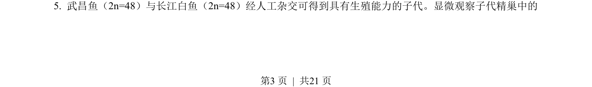
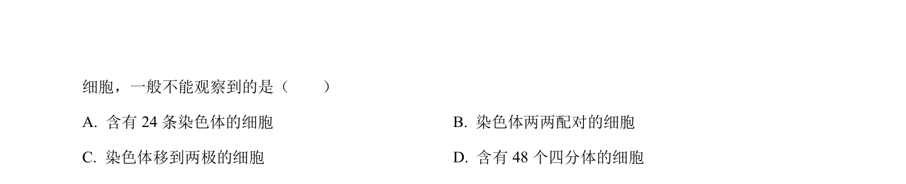
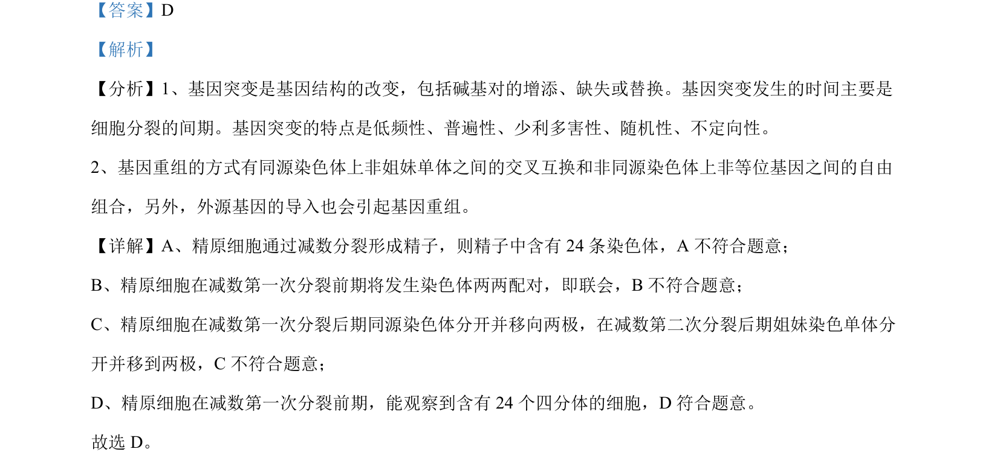

## 题面

## 摘要

本题考查减数分裂过程中染色体行为及害虫抗性基因频率变化相关措施分析。

## 关联考点

- [[减数分裂过程]]
- [[246-四分体|四分体]]
- [[803-基因频率|基因频率]]
- [[抗虫策略]]

## 答案与解析

> 📄 原 PDF 第 3 页：`素材/真题/北京/2008-2024·（北京）生物高考真题/2023年高考生物试卷（北京）（解析卷）.pdf`
