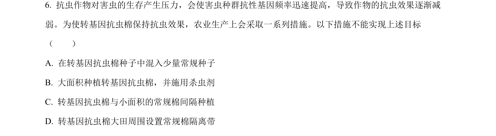
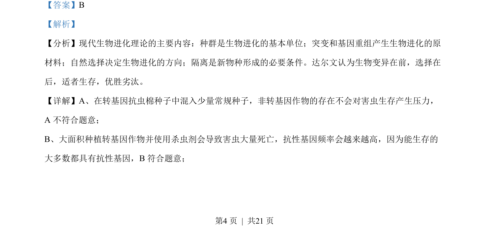
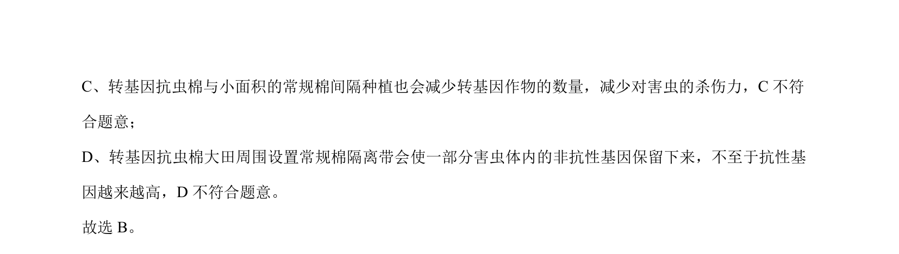

## 题面

## 摘要

通过种植方式分析害虫抗性基因频率变化，理解自然选择决定进化方向

## 关联考点

- [[803-基因频率|基因频率]]
- [[184-自然选择|自然选择]]
- [[307-现代生物进化理论|现代生物进化理论]]

## 答案与解析

> 📄 原 PDF 第 4 页：`素材/真题/北京/2008-2024·（北京）生物高考真题/2023年高考生物试卷（北京）（解析卷）.pdf`
