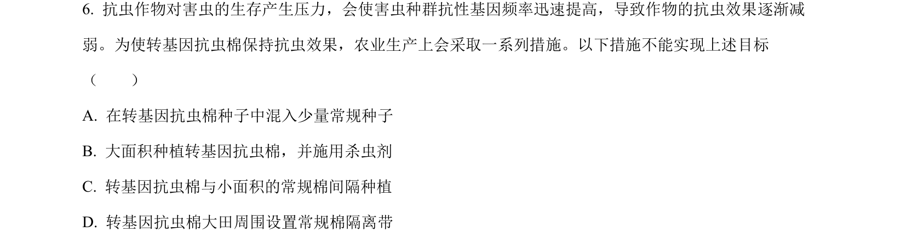
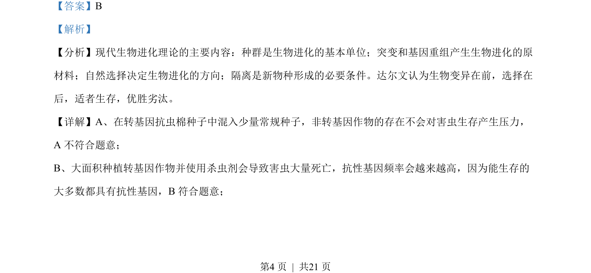
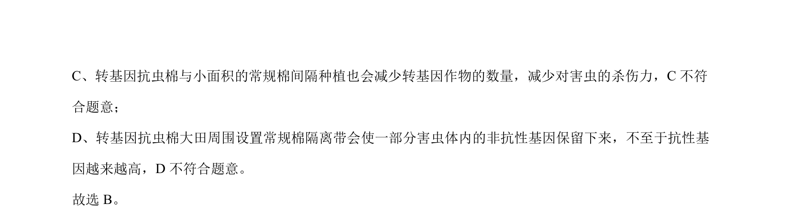

## 题面

## 摘要

通过种植方式分析害虫抗性基因频率变化，理解自然选择决定进化方向

## 关联考点

- [[803-基因频率|基因频率]]
- [[184-自然选择|自然选择]]
- [[307-现代生物进化理论|现代生物进化理论]]

## 答案与解析

> 📄 原 PDF 第 4 页：`素材/真题/北京/2008-2024·（北京）生物高考真题/2023年高考生物试卷（北京）（解析卷）.pdf`

<!-- 题干文本-start -->
## 题干文本
6. 抗虫作物对害虫的生存产生压力，会使害虫种群抗性基因频率迅速提高，导致作物的抗虫效果逐渐减
弱。为使转基因抗虫棉保持抗虫效果，农业生产上会采取一系列措施。以下措施不能实现上述目标
（　　）
A. 在转基因抗虫棉种子中混入少量常规种子
B. 大面积种植转基因抗虫棉，并施用杀虫剂
C. 转基因抗虫棉与小面积的常规棉间隔种植
D. 转基因抗虫棉大田周围设置常规棉隔离带
<!-- 题干文本-end -->

<!-- 解析文本-start -->
## 解析文本
【答案】B
【解析】
【分析】现代生物进化理论的主要内容：种群是生物进化的基本单位；突变和基因重组产生生物进化的原
材料；自然选择决定生物进化的方向；隔离是新物种形成的必要条件。达尔文认为生物变异在前，选择在
后，适者生存，优胜劣汰。
【详解】A、在转基因抗虫棉种子中混入少量常规种子，非转基因作物的存在不会对害虫生存产生压力，
A 不符合题意；
B、大面积种植转基因作物并使用杀虫剂会导致害虫大量死亡，抗性基因频率会越来越高，因为能生存的
大多数都具有抗性基因，B符合题意；
<!-- 解析文本-end -->
