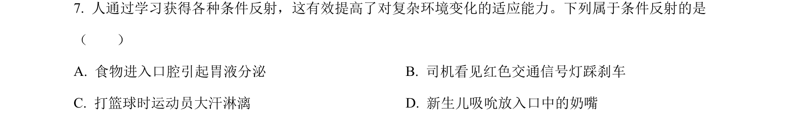
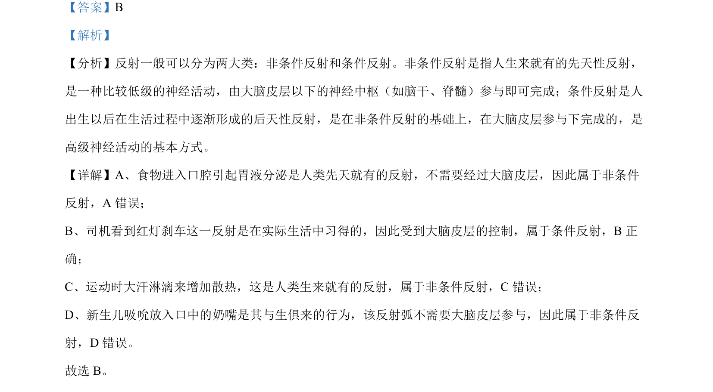

## 题面

## 摘要

考查非条件反射与条件反射的区别及实例判断。

## 关联考点

- [[非条件反射]]
- [[779-条件反射|条件反射]]
- [[324-神经调节|神经调节]]

## 答案与解析

> 📄 原 PDF 第 5 页：`素材/真题/北京/2008-2024·（北京）生物高考真题/2023年高考生物试卷（北京）（解析卷）.pdf`

<!-- 题干文本-start -->
## 题干文本
7. 人通过学习获得各种条件反射，这有效提高了对复杂环境变化的适应能力。下列属于条件反射的是
（　　）
A. 食物进入口腔引起胃液分泌 B. 司机看见红色交通信号灯踩刹车
C. 打篮球时运动员大汗淋漓 D. 新生儿吸吮放入口中的奶嘴
<!-- 题干文本-end -->

<!-- 解析文本-start -->
## 解析文本
【答案】B
【解析】
【分析】反射一般可以分为两大类：非条件反射和条件反射。非条件反射是指人生来就有的先天性反射，
是一种比较低级的神经活动，由大脑皮层以下的神经中枢（如脑干、脊髓）参与即可完成；条件反射是人
出生以后在生活过程中逐渐形成的后天性反射，是在非条件反射的基础上，在大脑皮层参与下完成的，是
高级神经活动的基本方式。
【详解】A、食物进入口腔引起胃液分泌是人类先天就有的反射，不需要经过大脑皮层，因此属于非条件
反射，A 错误；
B、司机看到红灯刹车这一反射是在实际生活中习得的，因此受到大脑皮层的控制，属于条件反射，B正
确；
C、运动时大汗淋漓来增加散热，这是人类生来就有的反射，属于非条件反射，C错误；
D、新生儿吸吮放入口中的奶嘴是其与生俱来的行为，该反射弧不需要大脑皮层参与，因此属于非条件反
射，D 错误。
故选 B。
<!-- 解析文本-end -->
