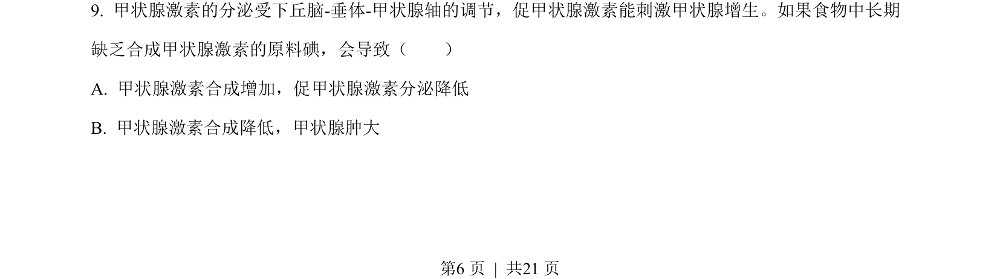
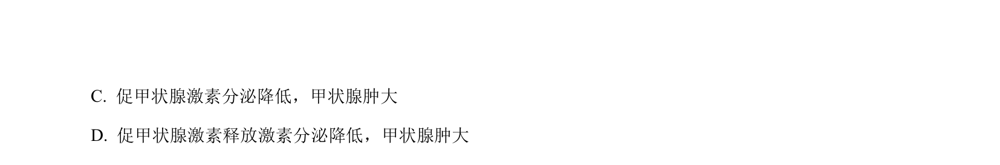
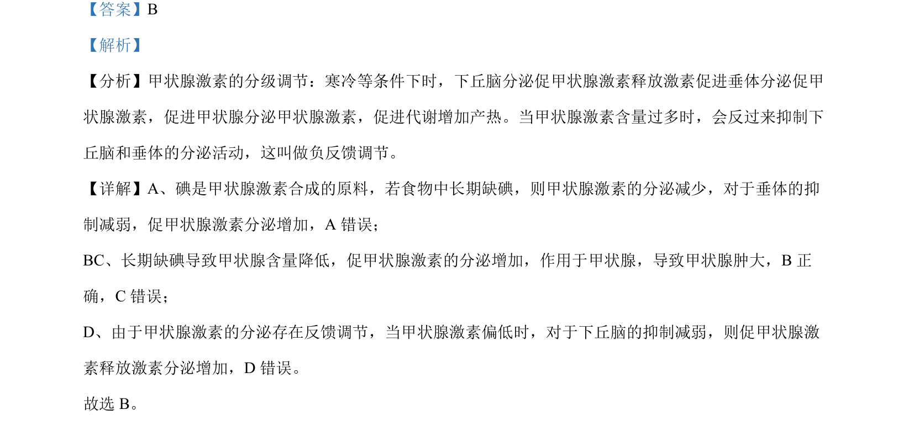

## 题面

## 摘要

考查甲状腺激素的分级调节与负反馈调节，分析碘缺乏对激素分泌和甲状腺的影响。

## 关联考点

- [[甲状腺激素的分级调节]]
- [[负反馈调节]]
- [[745-促甲状腺激素|促甲状腺激素]]
- [[甲状腺肿大]]

## 答案与解析

> 📄 原 PDF 第 6 页：`素材/真题/北京/2008-2024·（北京）生物高考真题/2023年高考生物试卷（北京）（解析卷）.pdf`
