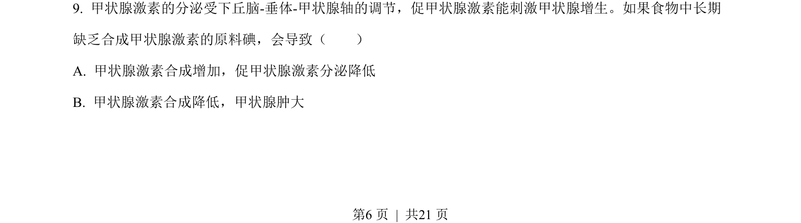
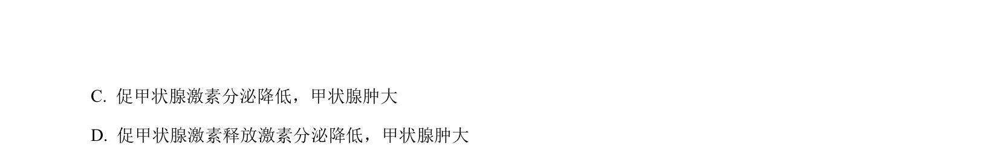
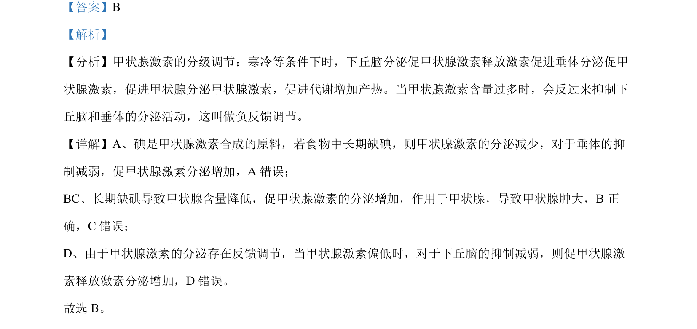

## 题面

## 摘要

考查甲状腺激素的分级调节与负反馈调节，分析碘缺乏对激素分泌和甲状腺的影响。

## 关联考点

- [[甲状腺激素的分级调节]]
- [[909-负反馈调节|负反馈调节]]
- [[745-促甲状腺激素|促甲状腺激素]]
- [[甲状腺肿大]]

## 答案与解析

> 📄 原 PDF 第 6 页：`素材/真题/北京/2008-2024·（北京）生物高考真题/2023年高考生物试卷（北京）（解析卷）.pdf`

<!-- 题干文本-start -->
## 题干文本
9. 甲状腺激素的分泌受下丘脑-垂体-甲状腺轴的调节，促甲状腺激素能刺激甲状腺增生。如果食物中长期
缺乏合成甲状腺激素的原料碘，会导致（　　）
A. 甲状腺激素合成增加，促甲状腺激素分泌降低
B. 甲状腺激素合成降低，甲状腺肿大
.
<!-- 题干文本-end -->

<!-- 解析文本-start -->
## 解析文本

<!-- 解析文本-end -->
