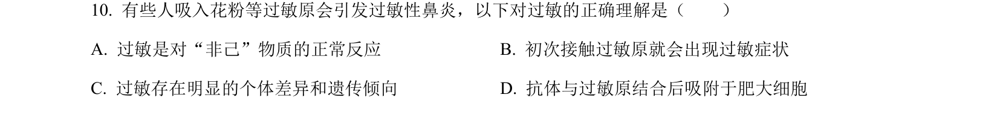
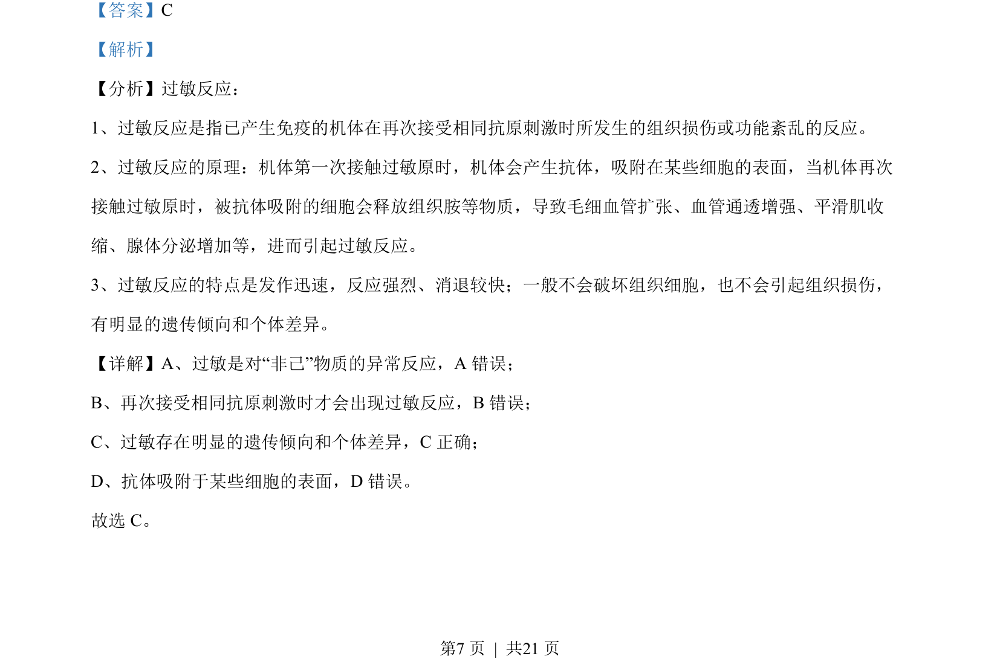

## 题面

## 摘要

本题考查过敏反应的定义、特点和抗体分布。

## 关联考点

- [[362-过敏反应|过敏反应]]
- [[免疫异常]]
- [[162-抗体|抗体]]
- [[组织胺]]

## 答案与解析

> 📄 原 PDF 第 7 页：`素材/真题/北京/2008-2024·（北京）生物高考真题/2023年高考生物试卷（北京）（解析卷）.pdf`

<!-- 题干文本-start -->
## 题干文本
10. 有些人吸入花粉等过敏原会引发过敏性鼻炎，以下对过敏的正确理解是（　　）
A. 过敏是对“非己”物质的正常反应 B. 初次接触过敏原就会出现过敏症状
C. 过敏存在明显的个体差异和遗传倾向 D. 抗体与过敏原结合后吸附于肥大细胞
<!-- 题干文本-end -->

<!-- 解析文本-start -->
## 解析文本
【答案】C
【解析】
【分析】过敏反应：
1、过敏反应是指已产生免疫的机体在再次接受相同抗原刺激时所发生的组织损伤或功能紊乱的反应。
2、过敏反应的原理：机体第一次接触过敏原时，机体会产生抗体，吸附在某些细胞的表面，当机体再次
接触过敏原时，被抗体吸附的细胞会释放组织胺等物质，导致毛细血管扩张、血管通透增强、平滑肌收
缩、腺体分泌增加等，进而引起过敏反应。
3、过敏反应的特点是发作迅速，反应强烈、消退较快；一般不会破坏组织细胞，也不会引起组织损伤，
有明显的遗传倾向和个体差异。
【详解】A、过敏是对“非己”物质的异常反应，A 错误；
B、再次接受相同抗原刺激时才会出现过敏反应，B错误；
C、过敏存在明显的遗传倾向和个体差异，C正确；
D、抗体吸附于某些细胞的表面，D 错误。
故选 C。
<!-- 解析文本-end -->
