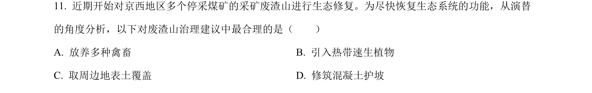
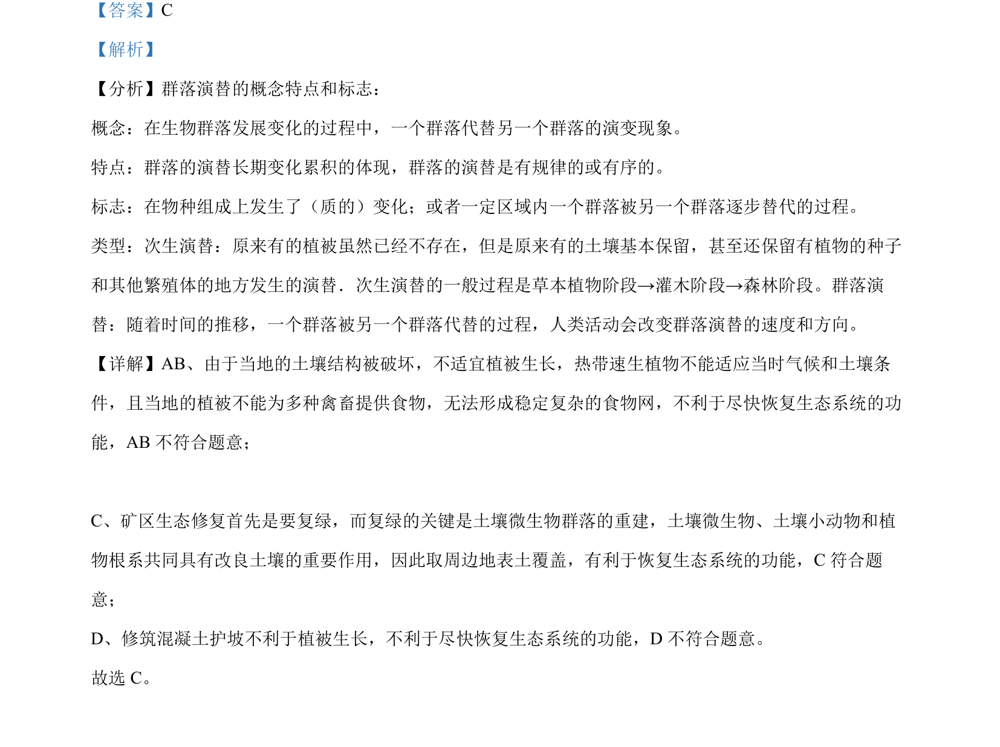

## 题面

## 摘要

矿区生态修复措施需结合群落演替原理，选择能恢复土壤微生物群落和植被的方法。

## 关联考点

- [[407-群落演替|群落演替]]
- [[次生演替]]
- [[398-生态修复|生态恢复]]
- [[土壤微生物]]

## 答案与解析

> 📄 原 PDF 第 8 页：`素材/真题/北京/2008-2024·（北京）生物高考真题/2023年高考生物试卷（北京）（解析卷）.pdf`
