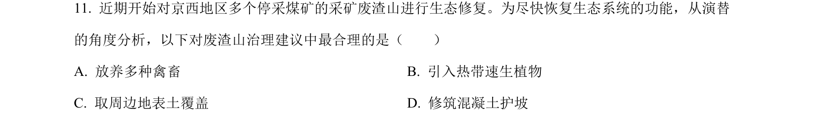
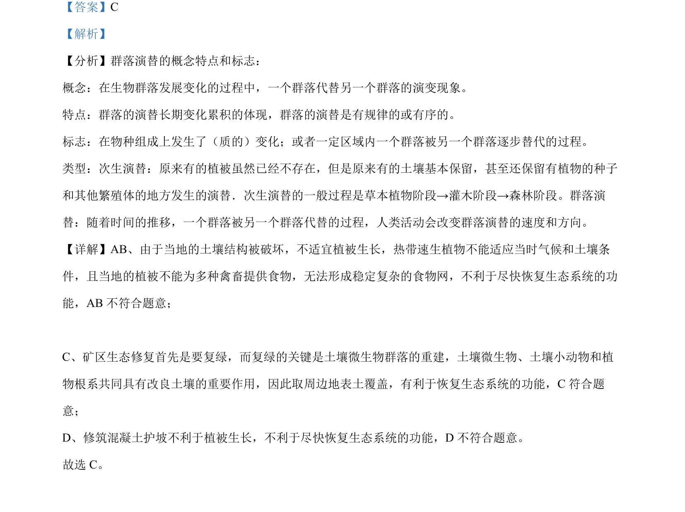

## 题面

## 摘要

矿区生态修复措施需结合群落演替原理，选择能恢复土壤微生物群落和植被的方法。

## 关联考点

- [[407-群落演替|群落演替]]
- [[917-次生演替|次生演替]]
- [[398-生态修复|生态恢复]]
- [[土壤微生物]]

## 答案与解析

> 📄 原 PDF 第 8 页：`素材/真题/北京/2008-2024·（北京）生物高考真题/2023年高考生物试卷（北京）（解析卷）.pdf`

<!-- 题干文本-start -->
## 题干文本
11. 近期开始对京西地区多个停采煤矿的采矿废渣山进行生态修复。为尽快恢复生态系统的功能，从演替
的角度分析，以下对废渣山治理建议中最合理的是（　　）
A. 放养多种禽畜 B. 引入热带速生植物
C. 取周边地表土覆盖 D. 修筑混凝土护坡
<!-- 题干文本-end -->

<!-- 解析文本-start -->
## 解析文本
【答案】C
【解析】
【分析】群落演替的概念特点和标志：
概念：在生物群落发展变化的过程中，一个群落代替另一个群落的演变现象。
特点：群落的演替长期变化累积的体现，群落的演替是有规律的或有序的。
标志：在物种组成上发生了（质的）变化；或者一定区域内一个群落被另一个群落逐步替代的过程。
类型：次生演替：原来有的植被虽然已经不存在，但是原来有的土壤基本保留，甚至还保留有植物的种子
和其他繁殖体的地方发生的演替．次生演替的一般过程是草本植物阶段→灌木阶段→森林阶段。群落演
替：随着时间的推移，一个群落被另一个群落代替的过程，人类活动会改变群落演替的速度和方向。
【详解】AB、由于当地的土壤结构被破坏，不适宜植被生长，热带速生植物不能适应当时气候和土壤条
件，且当地的植被不能为多种禽畜提供食物，无法形成稳定复杂的食物网，不利于尽快恢复生态系统的功
能，AB 不符合题意；
C、矿区生态修复首先是要复绿，而复绿的关键是土壤微生物群落的重建，土壤微生物、土壤小动物和植
物根系共同具有改良土壤的重要作用，因此取周边地表土覆盖，有利于恢复生态系统的功能，C符合题
意；
D、修筑混凝土护坡不利于植被生长，不利于尽快恢复生态系统的功能，D 不符合题意。
故选 C。
<!-- 解析文本-end -->
