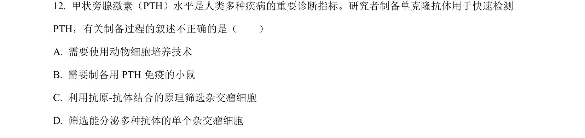
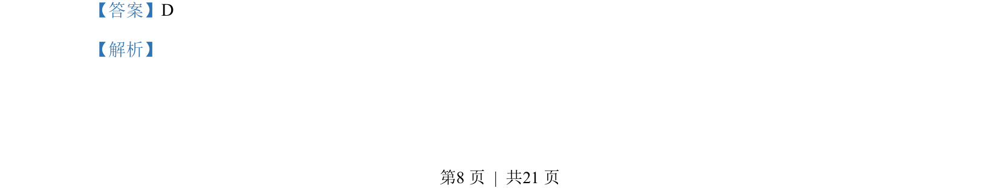
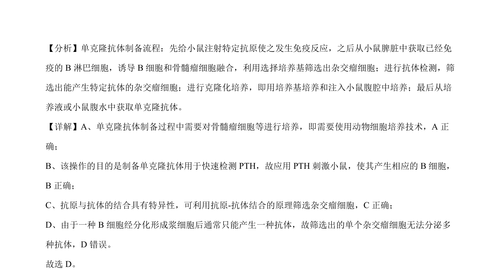

## 题面

## 摘要

本题考查单克隆抗体制备流程及原理，包括动物细胞培养、抗原刺激和筛选等。

## 关联考点

- [[451-单克隆抗体|单克隆抗体]]
- [[449-动物细胞培养|动物细胞培养]]
- [[抗原-抗体特异性结合]]
- [[杂交瘤细胞]]

## 答案与解析

> 📄 原 PDF 第 8 页：`素材/真题/北京/2008-2024·（北京）生物高考真题/2023年高考生物试卷（北京）（解析卷）.pdf`
