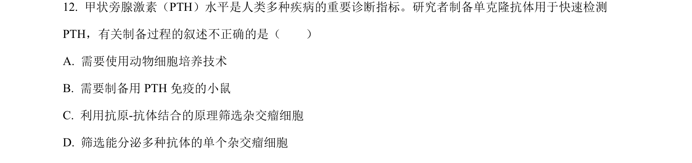
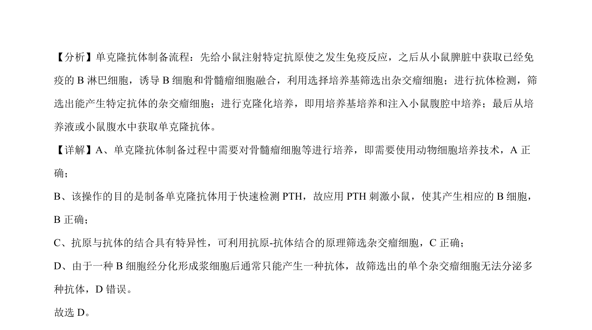

## 题面

## 摘要

本题考查单克隆抗体制备流程及原理，包括动物细胞培养、抗原刺激和筛选等。

## 关联考点

- [[451-单克隆抗体|单克隆抗体]]
- [[449-动物细胞培养|动物细胞培养]]
- [[抗原-抗体特异性结合]]
- [[杂交瘤细胞]]

## 答案与解析

> 📄 原 PDF 第 8 页：`素材/真题/北京/2008-2024·（北京）生物高考真题/2023年高考生物试卷（北京）（解析卷）.pdf`

<!-- 题干文本-start -->
## 题干文本
12. 甲状旁腺激素（PTH）水平是人类多种疾病的重要诊断指标。研究者制备单克隆抗体用于快速检测
PTH，有关制备过程的叙述不正确的是（　　）
A. 需要使用动物细胞培养技术
B. 需要制备用 PTH 免疫的小鼠
C. 利用抗原-抗体结合的原理筛选杂交瘤细胞
D. 筛选能分泌多种抗体的单个杂交瘤细胞
<!-- 题干文本-end -->

<!-- 解析文本-start -->
## 解析文本
【答案】D
【解析】
<!-- 解析文本-end -->
