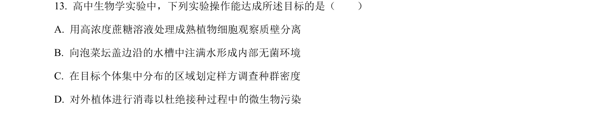
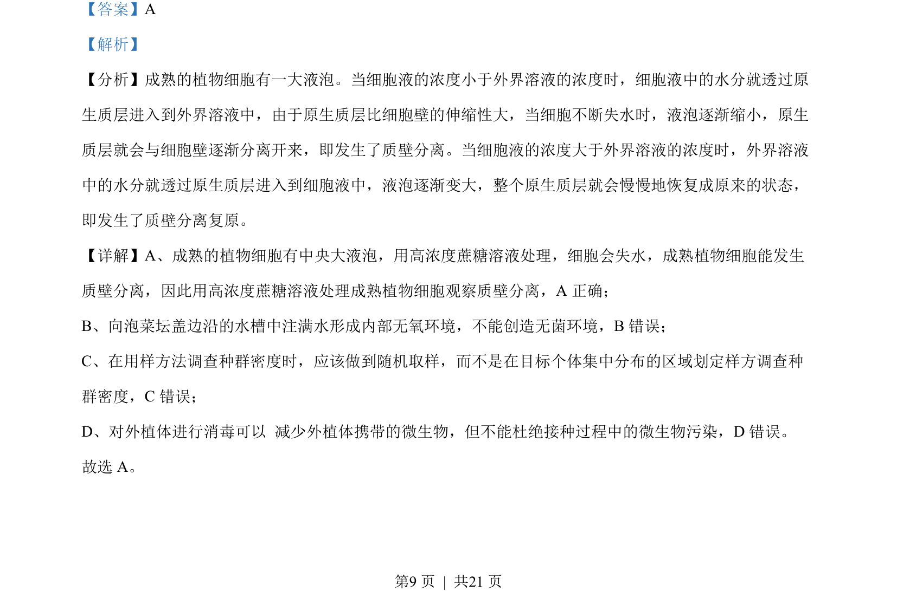

## 题面

## 摘要

考查植物细胞质壁分离原理及实验操作正误判断。

## 关联考点

- [[262-质壁分离|质壁分离]]
- [[原生质层]]
- [[666-实验分析|实验分析]]
- [[041-植物细胞|植物细胞]]

## 答案与解析

> 📄 原 PDF 第 9 页：`素材/真题/北京/2008-2024·（北京）生物高考真题/2023年高考生物试卷（北京）（解析卷）.pdf`
