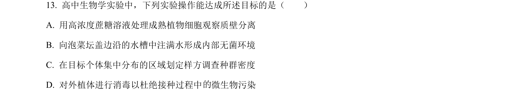
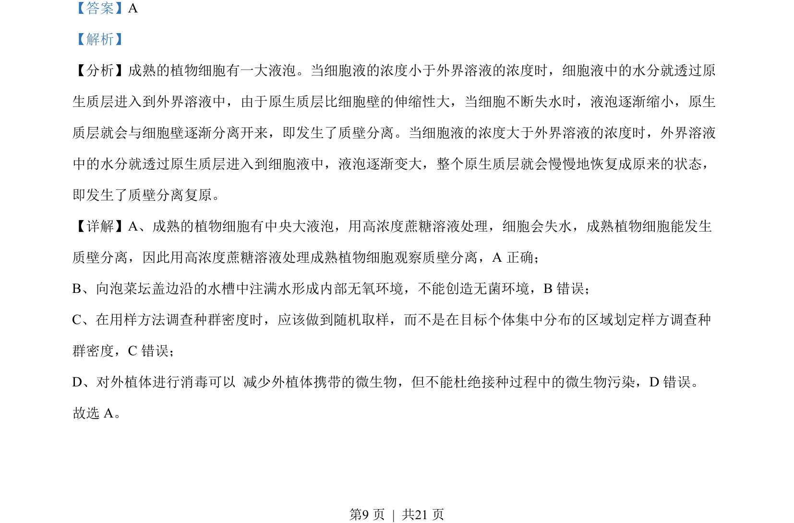

## 题面

## 摘要

考查植物细胞质壁分离原理及实验操作正误判断。

## 关联考点

- [[262-质壁分离|质壁分离]]
- [[原生质层]]
- [[666-实验分析|实验分析]]
- [[041-植物细胞|植物细胞]]

## 答案与解析

> 📄 原 PDF 第 9 页：`素材/真题/北京/2008-2024·（北京）生物高考真题/2023年高考生物试卷（北京）（解析卷）.pdf`

<!-- 题干文本-start -->
## 题干文本
13. 高中生物学实验中，下列实验操作能达成所述目标的是（　　）
A. 用高浓度蔗糖溶液处理成熟植物细胞观察质壁分离
B. 向泡菜坛盖边沿的水槽中注满水形成内部无菌环境
C. 在目标个体集中分布的区域划定样方调查种群密度
D. 对外植体进行消毒以杜绝接种过程中 微生物污染
<!-- 题干文本-end -->

<!-- 解析文本-start -->
## 解析文本
【答案】A
【解析】
【分析】成熟的植物细胞有一大液泡。当细胞液的浓度小于外界溶液的浓度时，细胞液中的水分就透过原
生质层进入到外界溶液中，由于原生质层比细胞壁的伸缩性大，当细胞不断失水时，液泡逐渐缩小，原生
质层就会与细胞壁逐渐分离开来，即发生了质壁分离。当细胞液的浓度大于外界溶液的浓度时，外界溶液
中的水分就透过原生质层进入到细胞液中，液泡逐渐变大，整个原生质层就会慢慢地恢复成原来的状态，
即发生了质壁分离复原。
【详解】A、成熟的植物细胞有中央大液泡，用高浓度蔗糖溶液处理，细胞会失水，成熟植物细胞能发生
质壁分离，因此用高浓度蔗糖溶液处理成熟植物细胞观察质壁分离，A 正确；
B、向泡菜坛盖边沿的水槽中注满水形成内部无氧环境，不能创造无菌环境，B错误；
C、在用样方法调查种群密度时，应该做到随机取样，而不是在目标个体集中分布的区域划定样方调查种
群密度，C错误；
D、对外植体进行消毒可以 减少外植体携带的微生物，但不能杜绝接种过程中的微生物污染，D 错误。
故选 A。
的
<!-- 解析文本-end -->
