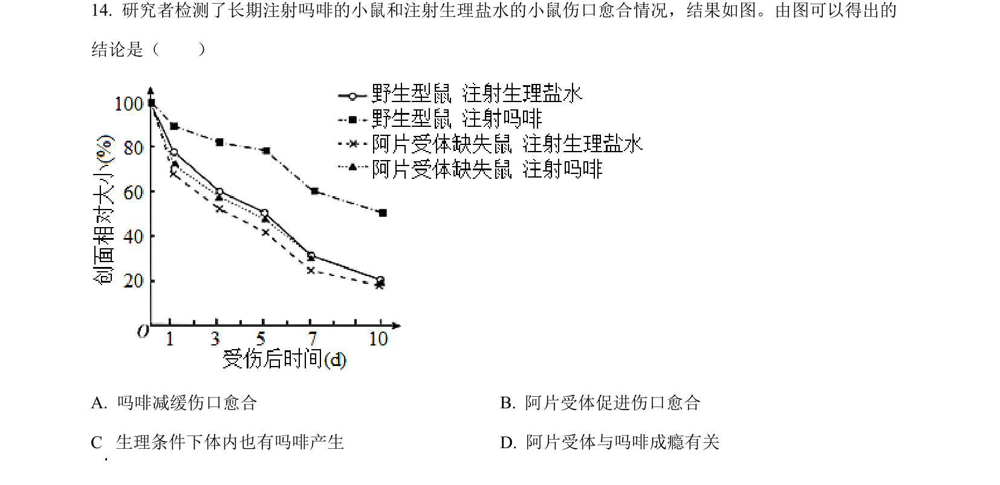
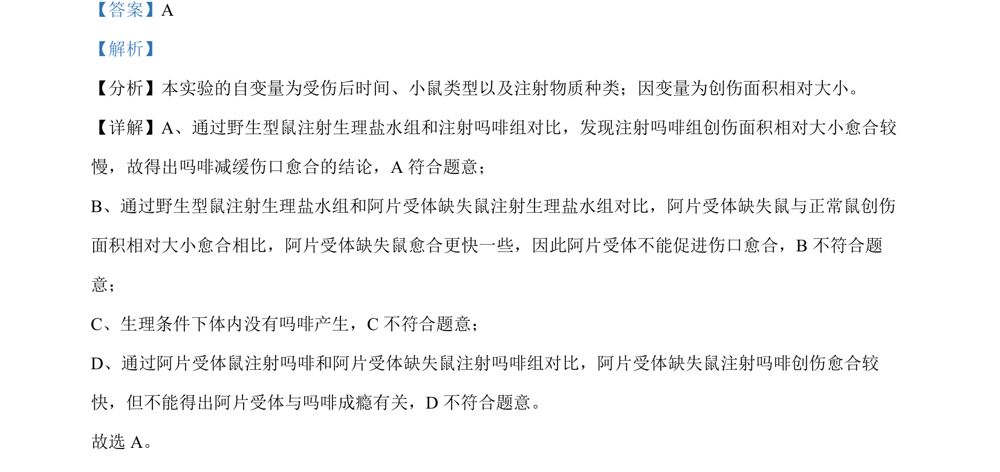

## 题面

## 摘要

探究吗啡与阿片受体对伤口愈合影响的实验分析

## 关联考点

- [[811-变量控制|实验变量]]
- [[485-对照实验|对照实验]]
- [[动物生理调节]]

## 答案与解析

> 📄 原 PDF 第 10 页：`素材/真题/北京/2008-2024·（北京）生物高考真题/2023年高考生物试卷（北京）（解析卷）.pdf`

<!-- 题干文本-start -->
## 题干文本
14. 研究者检测了长期注射吗啡的小鼠和注射生理盐水的小鼠伤口愈合情况，结果如图。由图可以得出的
结论是（　　）
  
A. 吗啡减缓伤口愈合 B. 阿片受体促进伤口愈合
C  生理条件下体内也有吗啡产生 D. 阿片受体与吗啡成瘾有关
<!-- 题干文本-end -->

<!-- 解析文本-start -->
## 解析文本
【答案】A
【解析】
【分析】本实验的自变量为受伤后时间、小鼠类型以及注射物质种类；因变量为创伤面积相对大小。
【详解】A、通过野生型鼠注射生理盐水组和注射吗啡组对比，发现注射吗啡组创伤面积相对大小愈合较
慢，故得出吗啡减缓伤口愈合的结论，A 符合题意；
B、通过野生型鼠注射生理盐水组和阿片受体缺失鼠注射生理盐水组对比，阿片受体缺失鼠与正常鼠创伤
面积相对大小愈合相比，阿片受体缺失鼠愈合更快一些，因此阿片受体不能促进伤口愈合，B不符合题
意；
C、生理条件下体内没有吗啡产生，C不符合题意；
D、通过阿片受体鼠注射吗啡和阿片受体缺失鼠注射吗啡组对比，阿片受体缺失鼠注射吗啡创伤愈合较
快，但不能得出阿片受体与吗啡成瘾有关，D 不符合题意。
故选 A。
<!-- 解析文本-end -->
