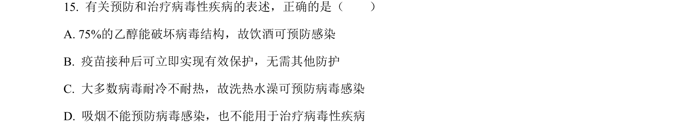
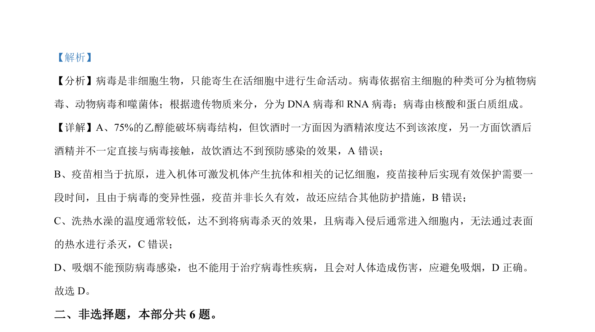

## 题面

## 摘要

该题考查病毒特性与感染预防，以及微生物分离培养和溶菌作用的实验探究。

## 关联考点

- [[122-病毒|病毒]]
- [[156-免疫|免疫]]
- [[428-微生物培养|微生物培养]]
- [[溶菌作用]]

## 答案与解析

> 📄 原 PDF 第 10 页：`素材/真题/北京/2008-2024·（北京）生物高考真题/2023年高考生物试卷（北京）（解析卷）.pdf`
