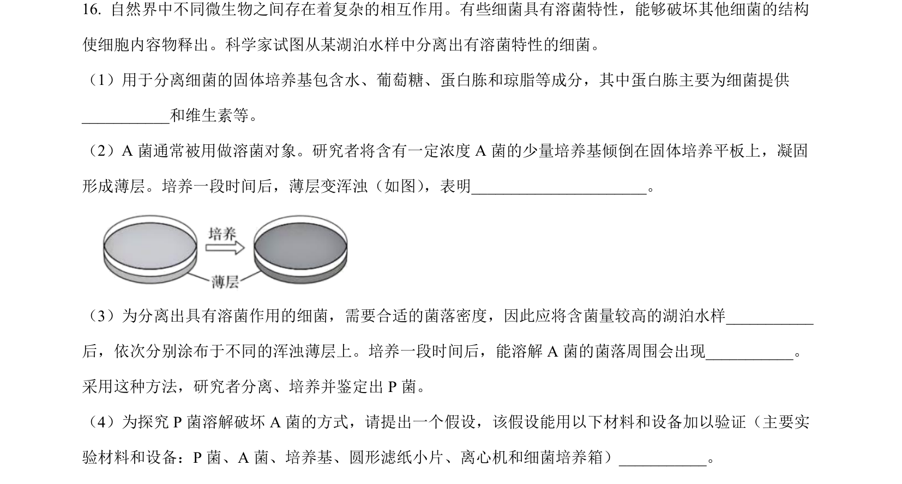
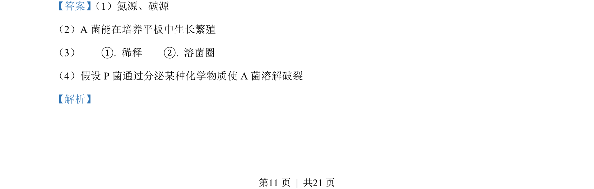
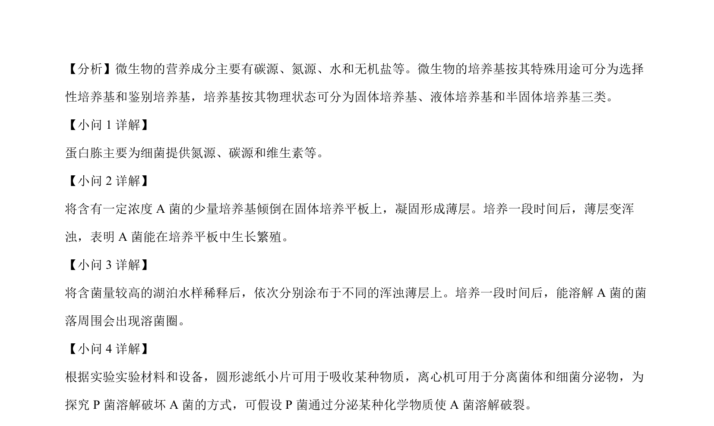

## 题面

## 摘要

静息电位形成机制，涉及细胞膜成分、K⁺外流平衡及静息电位的计算与分析。

## 关联考点

- [[细胞膜的成分]]
- [[329-静息电位|静息电位]]
- [[钾离子平衡电位]]
- [[Nernst方程]]

## 答案与解析

> 📄 原 PDF 第 11 页：`素材/真题/北京/2008-2024·（北京）生物高考真题/2023年高考生物试卷（北京）（解析卷）.pdf`
