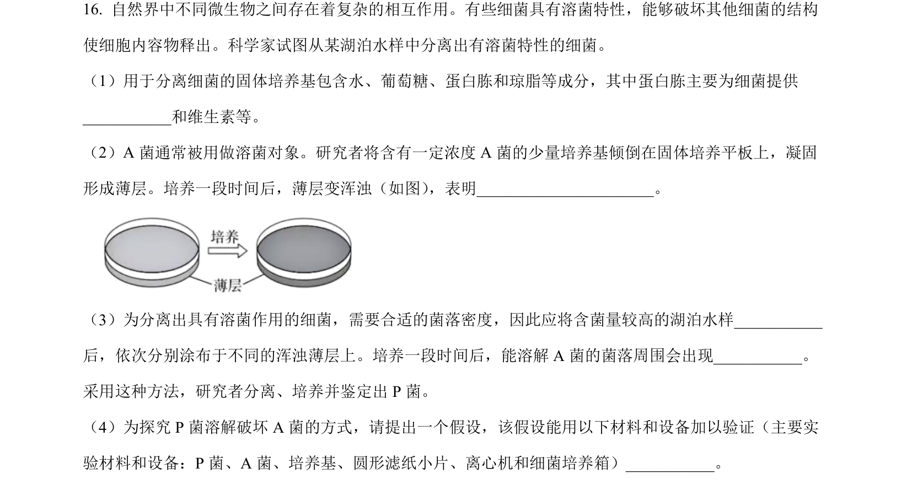
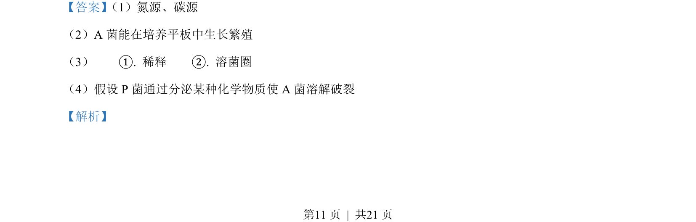
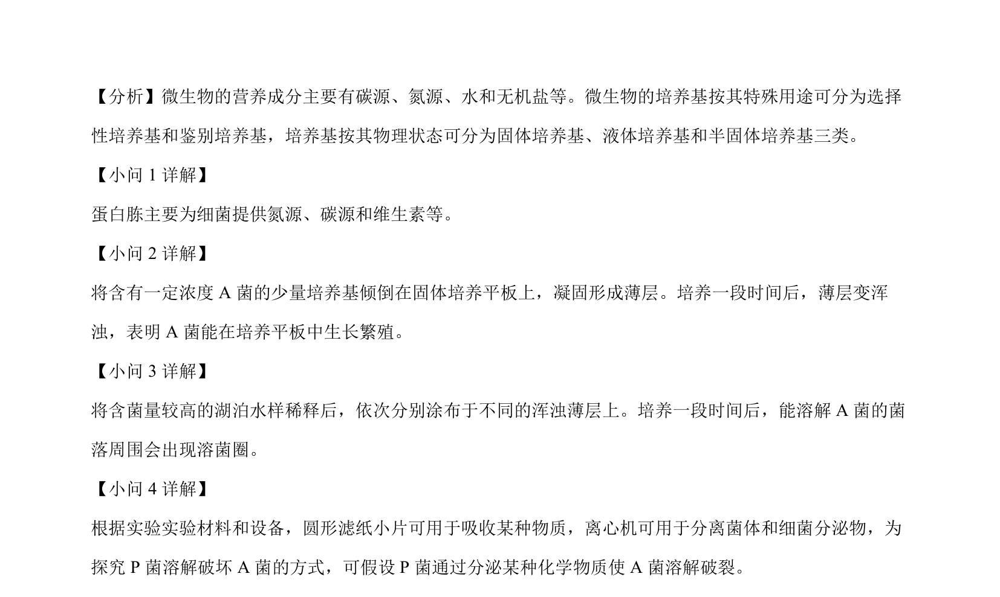

## 题面

## 摘要

静息电位形成机制，涉及细胞膜成分、K⁺外流平衡及静息电位的计算与分析。

## 关联考点

- [[细胞膜的成分]]
- [[329-静息电位|静息电位]]
- [[钾离子平衡电位]]
- [[Nernst方程]]

## 答案与解析

> 📄 原 PDF 第 11 页：`素材/真题/北京/2008-2024·（北京）生物高考真题/2023年高考生物试卷（北京）（解析卷）.pdf`

<!-- 题干文本-start -->
## 题干文本
16. 自然界中不同微生物之间存在着复杂的相互作用。有些细菌具有溶菌特性，能够破坏其他细菌的结构
使细胞内容物释出。科学家试图从某湖泊水样中分离出有溶菌特性的细菌。
（1）用于分离细菌的固体培养基包含水、葡萄糖、蛋白胨和琼脂等成分，其中蛋白胨主要为细菌提供
___________和维生素等。
（2）A 菌通常被用做溶菌对象。研究者将含有一定浓度 A 菌的少量培养基倾倒在固体培养平板上，凝固
形成薄层。培养一段时间后，薄层变浑浊（如图） ，表明______________________。
（3）为分离出具有溶菌作用的细菌，需要合适的菌落密度，因此应将含菌量较高的湖泊水样___________
后，依次分别涂布于不同的浑浊薄层上。培养一段时间后，能溶解 A 菌的菌落周围会出现___________。
采用这种方法，研究者分离、培养并鉴定出 P 菌。
（4）为探究 P 菌溶解破坏 A 菌的方式，请提出一个假设，该假设能用以下材料和设备加以验证（主要实
验材料和设备：P 菌、A 菌、培养基、圆形滤纸小片、离心机和细菌培养箱）___________。
<!-- 题干文本-end -->

<!-- 解析文本-start -->
## 解析文本
【答案】 （1）氮源、碳源    
（2）A 菌能在培养平板中生长繁殖    
（3）    ①. 稀释    ②. 溶菌圈    
（4）假设 P 菌通过分泌某种化学物质使 A 菌溶解破裂
【解析】
<!-- 解析文本-end -->
