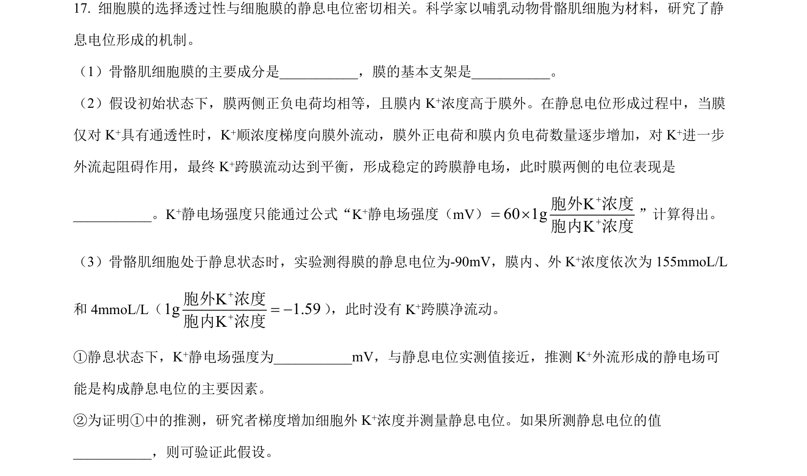
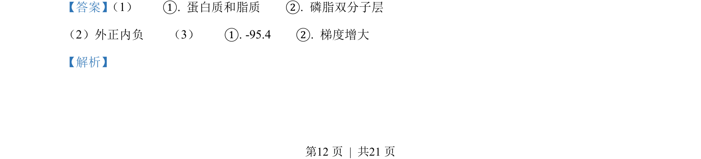
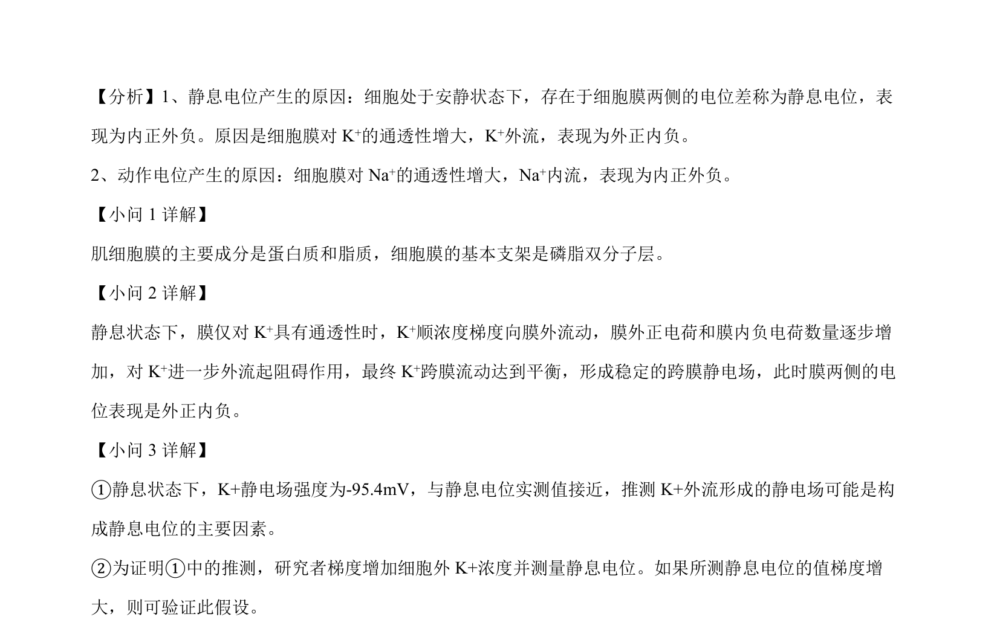

## 题面

## 摘要

本题考查静息电位与动作电位的产生机制，以及人工光照对节肢动物活跃程度和群落结构的影响实验。

## 关联考点

- [[329-静息电位|静息电位]]
- [[318-动作电位|动作电位]]
- [[K⁺外流]]
- [[生态因子]]
- [[869-群落结构|群落结构]]

## 答案与解析

> 📄 原 PDF 第 12 页：`素材/真题/北京/2008-2024·（北京）生物高考真题/2023年高考生物试卷（北京）（解析卷）.pdf`
