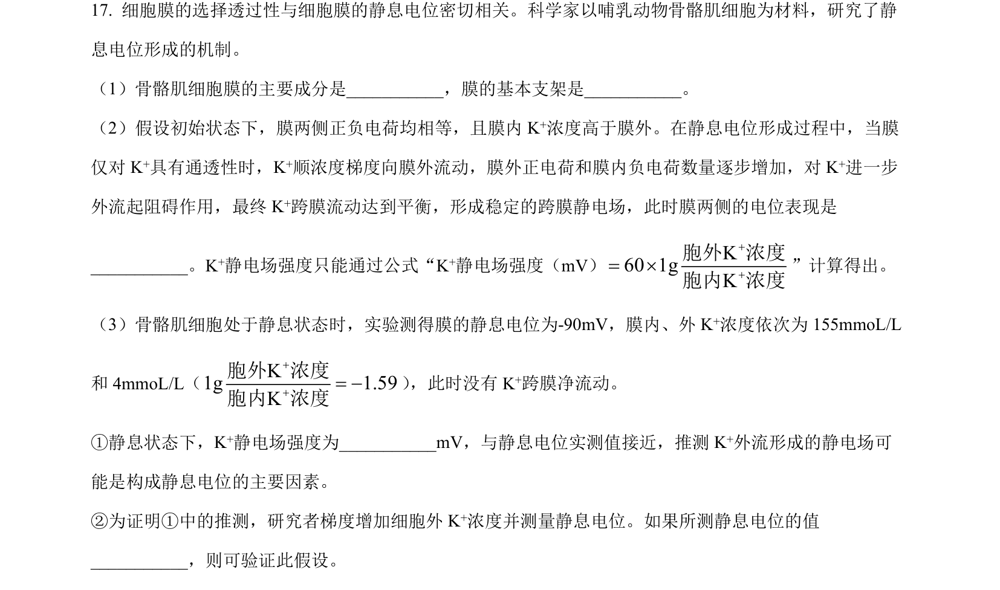
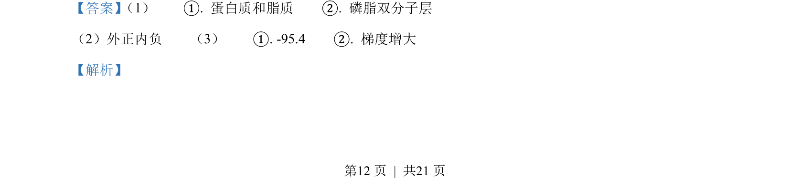
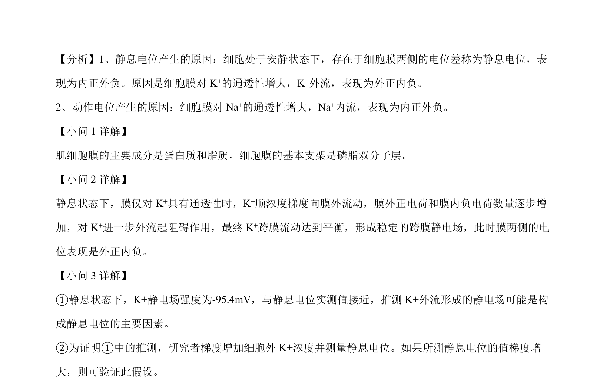

## 题面

## 摘要

本题考查静息电位与动作电位的产生机制，以及人工光照对节肢动物活跃程度和群落结构的影响实验。

## 关联考点

- [[329-静息电位|静息电位]]
- [[318-动作电位|动作电位]]
- [[K⁺外流]]
- [[生态因子]]
- [[868-群落的结构|群落结构]]

## 答案与解析

> 📄 原 PDF 第 12 页：`素材/真题/北京/2008-2024·（北京）生物高考真题/2023年高考生物试卷（北京）（解析卷）.pdf`

<!-- 题干文本-start -->
## 题干文本
17. 细胞膜的选择透过性与细胞膜的静息电位密切相关。科学家以哺乳动物骨骼肌细胞为材料，研究了静
息电位形成的机制。
（1）骨骼肌细胞膜的主要成分是___________，膜的基本支架是___________。
（2）假设初始状态下，膜两侧正负电荷均相等，且膜内 K+浓度高于膜外。在静息电位形成过程中，当膜
仅对 K+具有通透性时，K+顺浓度梯度向膜外流动，膜外正电荷和膜内负电荷数量逐步增加，对 K+进一步
外流起阻碍作用，最终 K+跨膜流动达到平衡，形成稳定的跨膜静电场，此时膜两侧的电位表现是
___________。K+静电场强度只能通过公式“K+静电场强度（mV） K60 1gK++= ´胞外浓度胞内浓度
”计算得出。
（3）骨骼肌细胞处于静息状态时，实验测得膜的静息电位为-90mV，膜内、外 K+浓度依次为 155mmoL/L
和 4mmoL/L（K1g 1.59K++= -胞外浓度胞内浓度
） ，此时没有K+跨膜净流动。
①静息状态下，K+静电场强度为___________mV，与静息电位实测值接近，推测 K+外流形成的静电场可
能是构成静息电位的主要因素。
②为证明①中的推测，研究者梯度增加细胞外 K+浓度并测量静息电位。如果所测静息电位的值
___________，则可验证此假设。
<!-- 题干文本-end -->

<!-- 解析文本-start -->
## 解析文本
【答案】 （1）    ①. 蛋白质和脂质    ②. 磷脂双分子层    
（2）外正内负    （3）    ①. -95.4    ②. 梯度增大
【解析】
<!-- 解析文本-end -->
