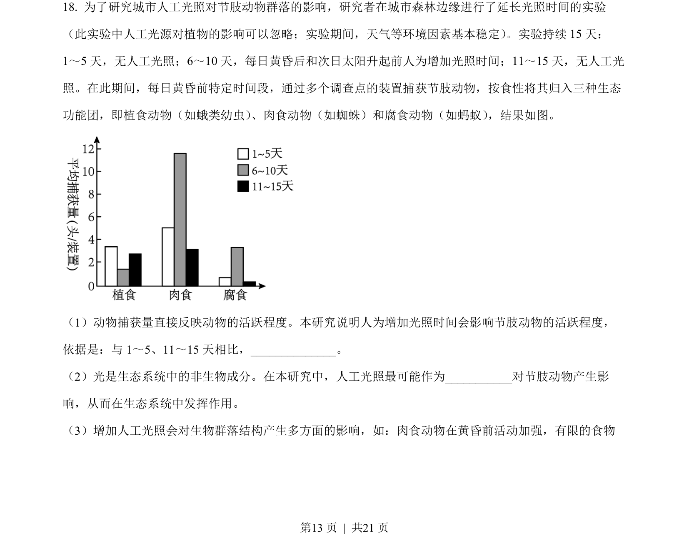
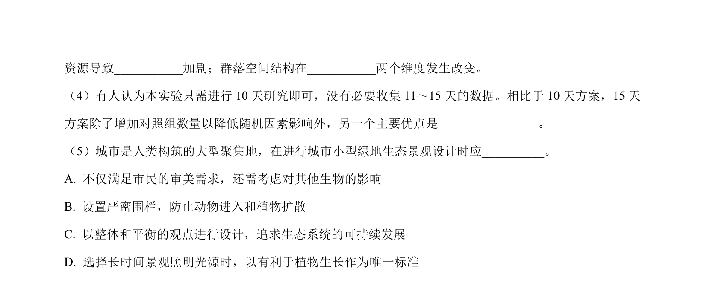
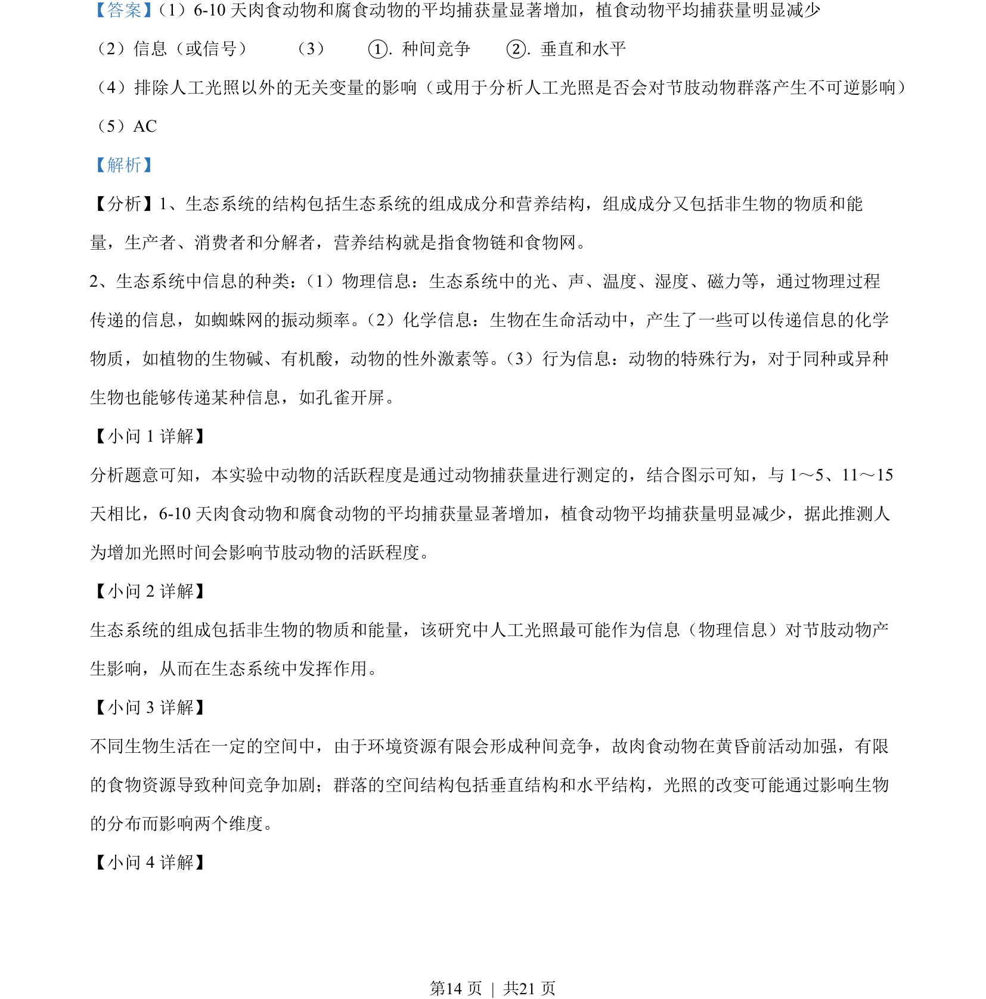
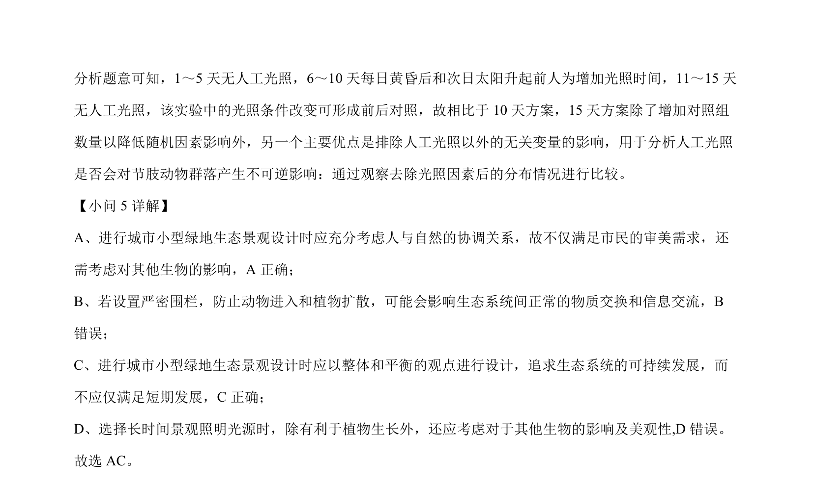

## 题面

## 摘要

本题综合考查生态系统的结构与信息传递实验分析，以及油菜遗传育种与分子检测。

## 关联考点

- [[502-生态系统的结构|生态系统的结构]]
- [[379-信息传递|信息传递]]
- [[517-遗传规律|遗传规律]]
- [[301-基因突变|基因突变]]
- [[PCR/限制酶电泳]]

## 答案与解析

> 📄 原 PDF 第 13 页：`素材/真题/北京/2008-2024·（北京）生物高考真题/2023年高考生物试卷（北京）（解析卷）.pdf`
