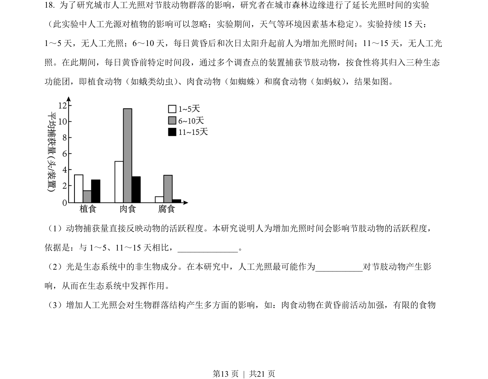
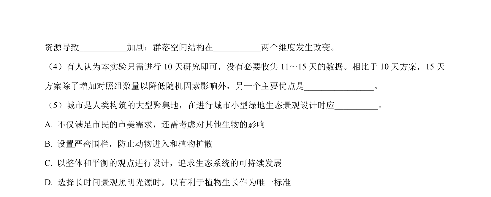
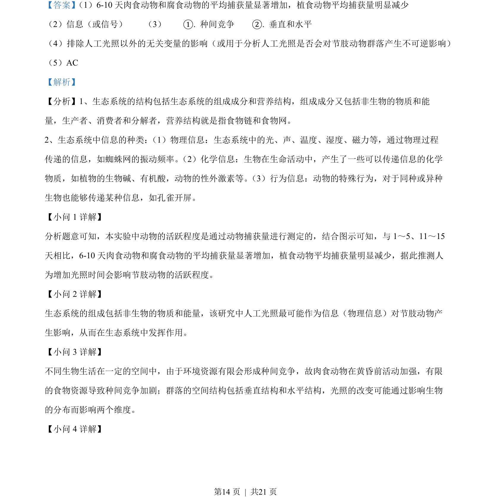
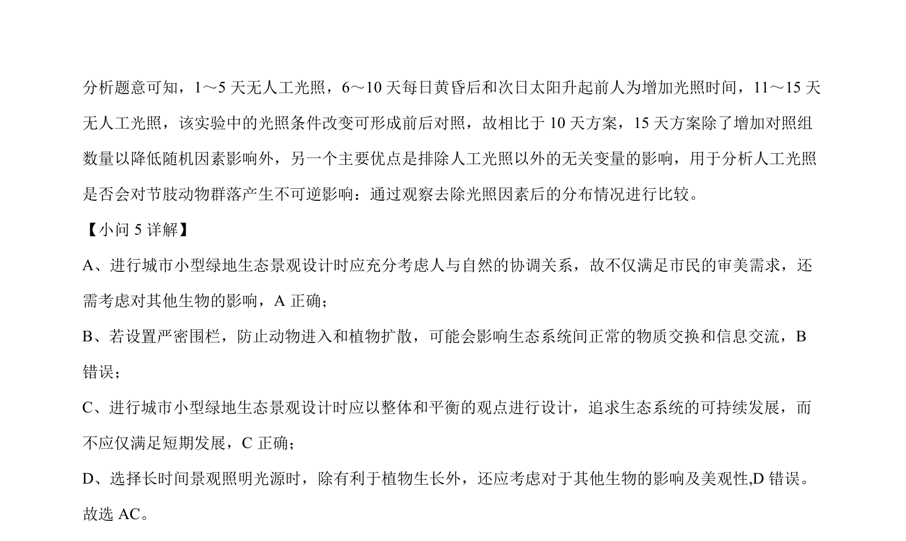

## 题面

## 摘要

本题综合考查生态系统的结构与信息传递实验分析，以及油菜遗传育种与分子检测。

## 关联考点

- [[502-生态系统的结构|生态系统的结构]]
- [[379-信息传递|信息传递]]
- [[517-遗传规律|遗传规律]]
- [[301-基因突变|基因突变]]
- [[PCR/限制酶电泳]]

## 答案与解析

> 📄 原 PDF 第 13 页：`素材/真题/北京/2008-2024·（北京）生物高考真题/2023年高考生物试卷（北京）（解析卷）.pdf`

<!-- 题干文本-start -->
## 题干文本
18. 为了研究城市人工光照对节肢动物群落的影响，研究者在城市森林边缘进行了延长光照时间的实验
（此实验中人工光源对植物的影响可以忽略；实验期间，天气等环境因素基本稳定） 。实验持续15 天：
1～5 天，无人工光照；6～10 天，每日黄昏后和次日太阳升起前人为增加光照时间；11～15 天，无人工光
照。在此期间，每日黄昏前特定时间段，通过多个调查点的装置捕获节肢动物，按食性将其归入三种生态
功能团，即植食动物（如蛾类幼虫） 、肉食动物（如蜘蛛）和腐食动物（如蚂蚁） ，结果如图。
  
（1）动物捕获量直接反映动物的活跃程度。本研究说明人为增加光照时间会影响节肢动物的活跃程度，
依据是：与 1～5、11～15 天相比，______________。
（2）光是生态系统中的非生物成分。在本研究中，人工光照最可能作为___________对节肢动物产生影
响，从而在生态系统中发挥作用。
（3）增加人工光照会对生物群落结构产生多方面的影响，如：肉食动物在黄昏前活动加强，有限的食物
<!-- 题干文本-end -->

<!-- 解析文本-start -->
## 解析文本

<!-- 解析文本-end -->
