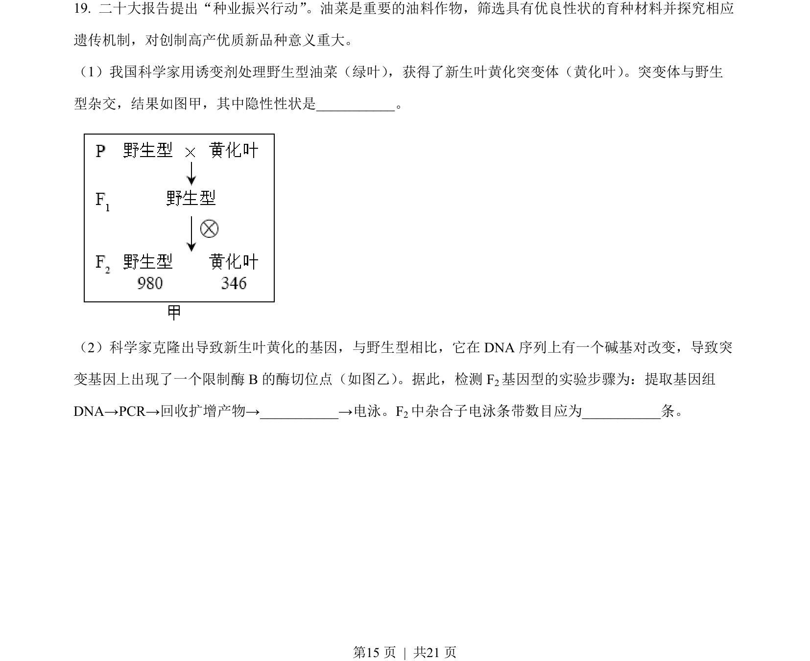
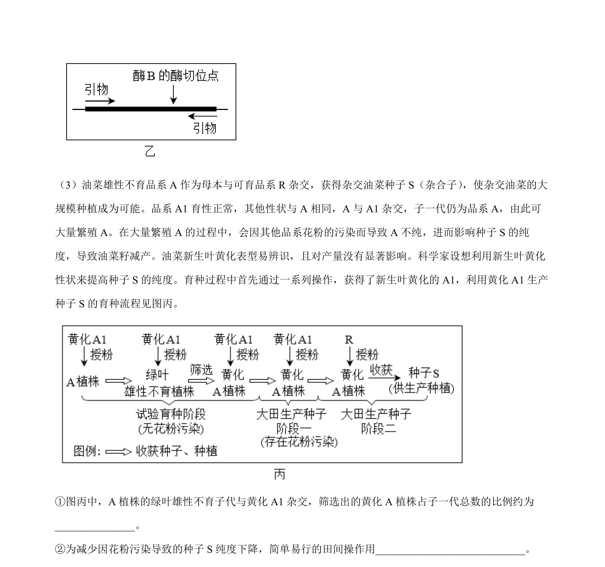
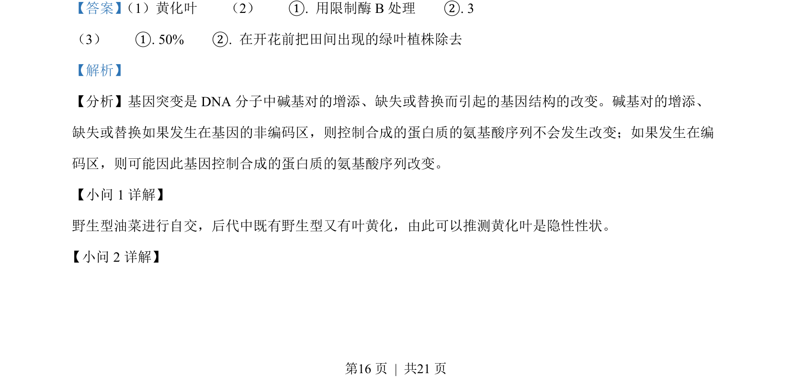
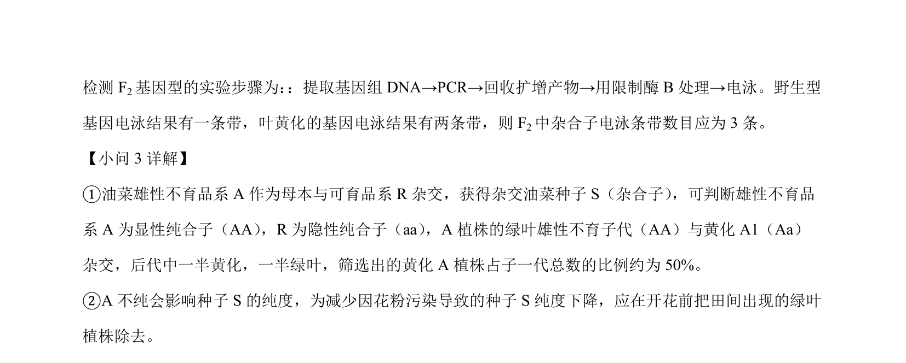

## 题面

## 摘要

该题考查基因突变、遗传规律应用和基于新情境的细胞凋亡机制分析。

## 关联考点

- [[301-基因突变|基因突变]]
- [[性状显隐性判断]]
- [[电泳法检测基因型]]
- [[叶绿体与线粒体协调]]

## 答案与解析

> 📄 原 PDF 第 15 页：`素材/真题/北京/2008-2024·（北京）生物高考真题/2023年高考生物试卷（北京）（解析卷）.pdf`
