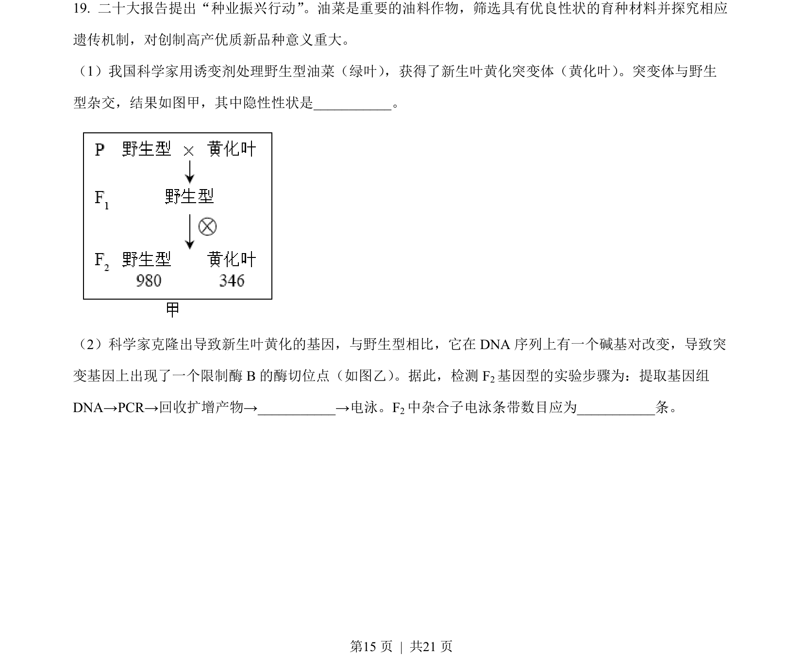
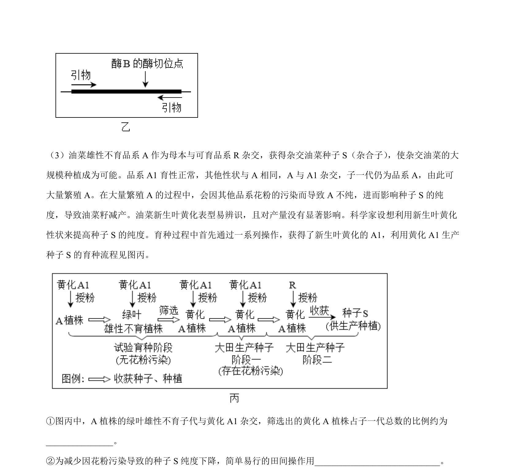
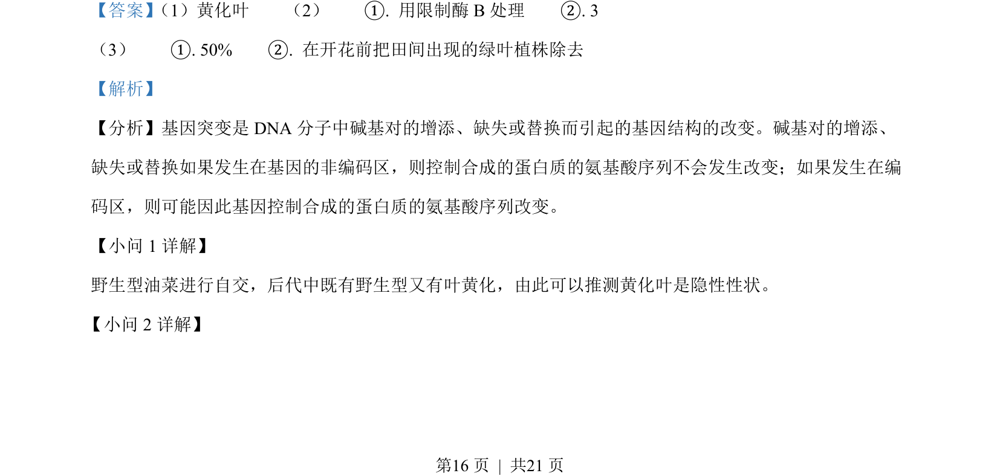
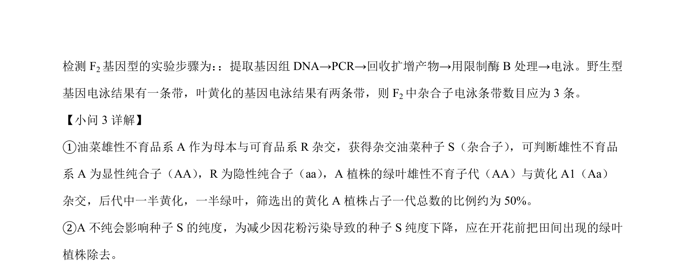

## 题面

## 摘要

该题考查基因突变、遗传规律应用和基于新情境的细胞凋亡机制分析。

## 关联考点

- [[301-基因突变|基因突变]]
- [[性状显隐性判断]]
- [[电泳法检测基因型]]
- [[叶绿体与线粒体协调]]

## 答案与解析

> 📄 原 PDF 第 15 页：`素材/真题/北京/2008-2024·（北京）生物高考真题/2023年高考生物试卷（北京）（解析卷）.pdf`

<!-- 题干文本-start -->
## 题干文本
19. 二十大报告提出“种业振兴行动”。油菜是重要的油料作物，筛选具有优良性状的育种材料并探究相应
遗传机制，对创制高产优质新品种意义重大。
（1）我国科学家用诱变剂处理野生型油菜（绿叶） ，获得了新生叶黄化突变体（黄化叶） 。突变体与野生
型杂交，结果如图甲，其中隐性性状是___________。
  
（2）科学家克隆出导致新生叶黄化的基因，与野生型相比，它在 DNA 序列上有一个碱基对改变，导致突
变基因上出现了一个限制酶 B的酶切位点（如图乙） 。据此，检测F2基因型的实验步骤为：提取基因组
DNA→PCR→回收扩增产物→___________→电泳。F2中杂合子电泳条带数目应为___________条。
<!-- 题干文本-end -->

<!-- 解析文本-start -->
## 解析文本

<!-- 解析文本-end -->
