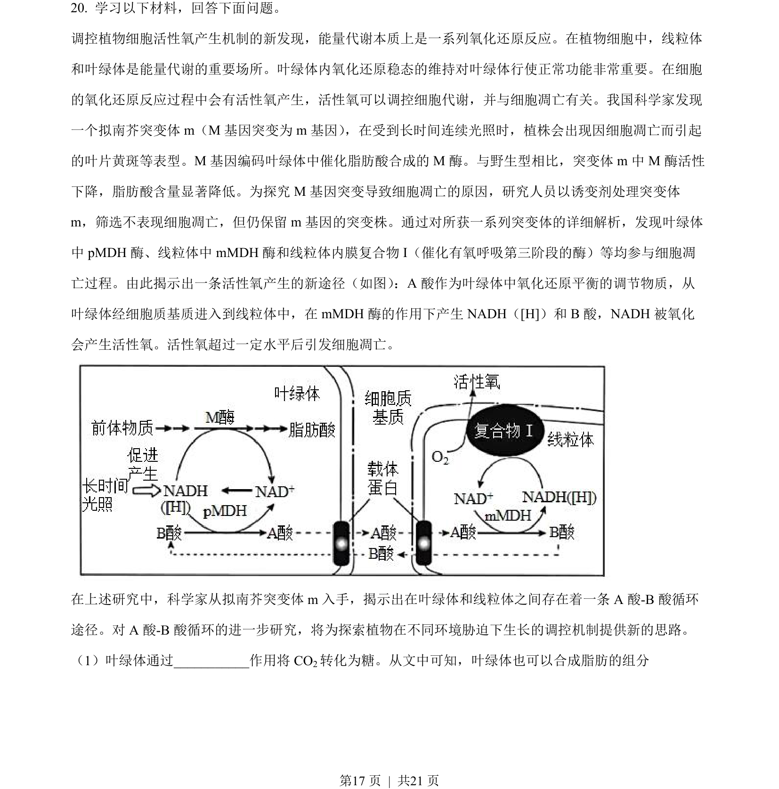
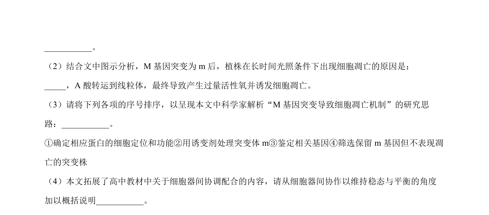
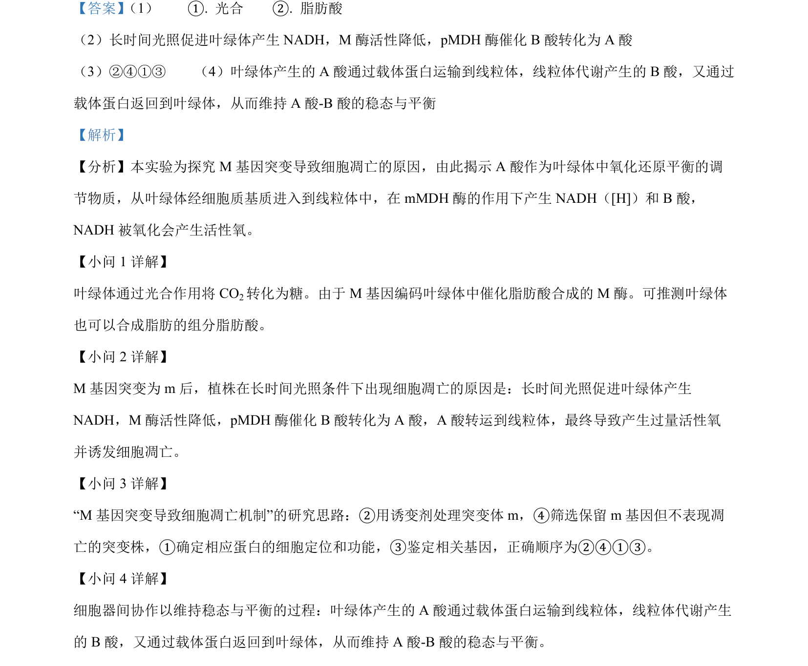

## 题面

## 摘要

（待补）

## 关联考点

## 答案与解析

> 📄 原 PDF 第 17 页：`素材/真题/北京/2008-2024·（北京）生物高考真题/2023年高考生物试卷（北京）（解析卷）.pdf`

<!-- 题干文本-start -->
## 题干文本
20. 学习以下材料，回答下面问题。
调控植物细胞活性氧产生机制的新发现，能量代谢本质上是一系列氧化还原反应。在植物细胞中，线粒体
和叶绿体是能量代谢的重要场所。叶绿体内氧化还原稳态的维持对叶绿体行使正常功能非常重要。在细胞
的氧化还原反应过程中会有活性氧产生，活性氧可以调控细胞代谢，并与细胞凋亡有关。我国科学家发现
一个拟南芥突变体 m（M 基因突变为 m基因） ，在受到长时间连续光照时，植株会出现因细胞凋亡而引起
的叶片黄斑等表型。M 基因编码叶绿体中催化脂肪酸合成的 M 酶。与野生型相比，突变体 m中 M 酶活性
下降，脂肪酸含量显著降低。为探究 M 基因突变导致细胞凋亡的原因，研究人员以诱变剂处理突变体
m，筛选不表现细胞凋亡，但仍保留 m基因的突变株。通过对所获一系列突变体的详细解析，发现叶绿体
中 pMDH 酶、线粒体中 mMDH 酶和线粒体内膜复合物 I（催化有氧呼吸第三阶段的酶）等均参与细胞凋
亡过程。由此揭示出一条活性氧产生的新途径（如图） ：A 酸作为叶绿体中氧化还原平衡的调节物质，从
叶绿体经细胞质基质进入到线粒体中，在 mMDH 酶的作用下产生 NADH（[H]）和 B酸，NADH 被氧化
会产生活性氧。活性氧超过一定水平后引发细胞凋亡。
    
在上述研究中，科学家从拟南芥突变体 m入手，揭示出在叶绿体和线粒体之间存在着一条 A 酸-B 酸循环
途径。对 A 酸-B 酸循环的进一步研究，将为探索植物在不同环境胁迫下生长的调控机制提供新的思路。
（1）叶绿体通过___________作用将 CO2转化为糖。从文中可知，叶绿体也可以合成脂肪的组分
<!-- 题干文本-end -->

<!-- 解析文本-start -->
## 解析文本

<!-- 解析文本-end -->
