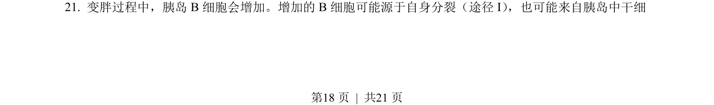
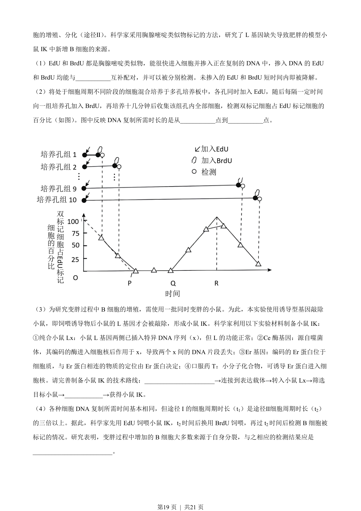
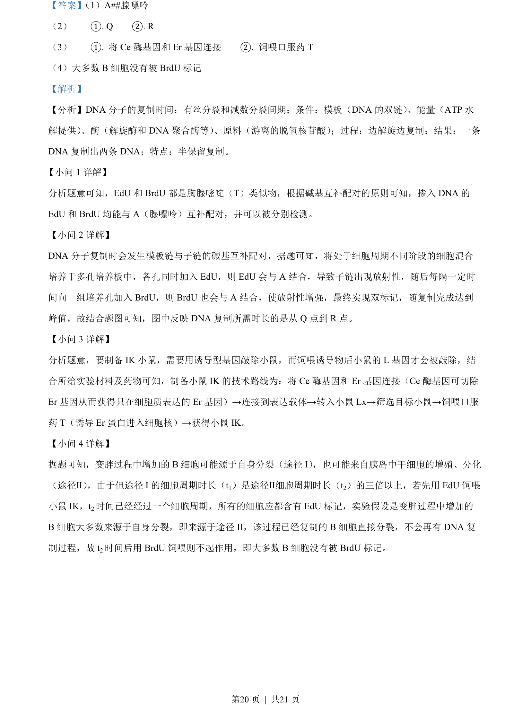

## 题面

## 摘要

本题通过 EdU/BrdU 双标记实验探究 DNA 复制时长及细胞增殖来源。

## 关联考点

- [[285-DNA复制|DNA复制]]
- [[290-碱基互补配对|碱基互补配对]]
- [[252-细胞周期|细胞周期]]
- [[913-同位素标记|同位素标记]]

## 答案与解析

> 📄 原 PDF 第 18 页：`素材/真题/北京/2008-2024·（北京）生物高考真题/2023年高考生物试卷（北京）（解析卷）.pdf`
