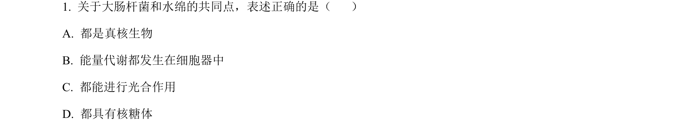
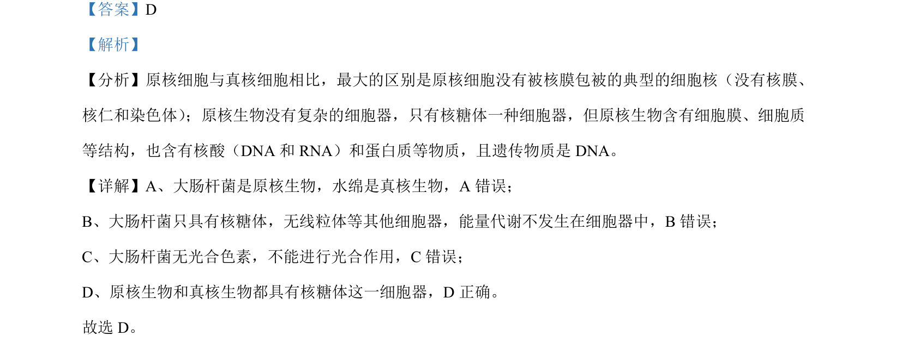

## 题面

## 摘要

原核细胞与真核细胞差异及DNA亲缘鉴定依据

## 关联考点

- [[205-原核细胞|原核细胞]]
- [[208-真核细胞|真核细胞]]
- [[225-核糖体|核糖体]]
- [[DNA碱基序列]]

## 答案与解析

> 📄 原 PDF 第 1 页：`素材/真题/北京/2008-2024·（北京）生物高考真题/2024年高考生物试卷（北京）（解析卷）.pdf`
