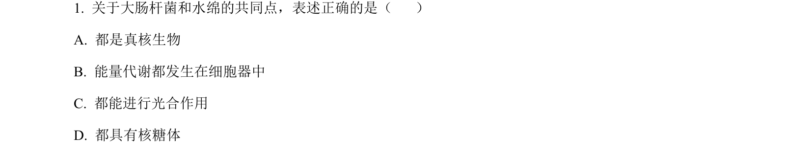
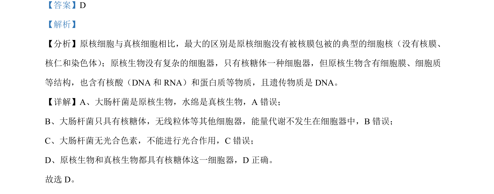

## 题面

## 摘要

原核细胞与真核细胞差异及DNA亲缘鉴定依据

## 关联考点

- [[205-原核细胞|原核细胞]]
- [[208-真核细胞|真核细胞]]
- [[225-核糖体|核糖体]]
- [[DNA碱基序列]]

## 答案与解析

> 📄 原 PDF 第 1 页：`素材/真题/北京/2008-2024·（北京）生物高考真题/2024年高考生物试卷（北京）（解析卷）.pdf`

<!-- 题干文本-start -->
## 题干文本
1. 关于大肠杆菌和水绵的共同点，表述正确的是（    ）
A. 都是真核生物
B. 能量代谢都发生在细胞器中
C. 都能进行光合作用
D. 都具有核糖体
<!-- 题干文本-end -->

<!-- 解析文本-start -->
## 解析文本
【答案】D
【解析】
【分析】原核细胞与真核细胞相比，最大的区别是原核细胞没有被核膜包被的典型的细胞核（没有核膜、
核仁和染色体） ；原核生物没有复杂的细胞器，只有核糖体一种细胞器，但原核生物含有细胞膜、细胞质
等结构，也含有核酸（DNA 和 RNA）和蛋白质等物质，且遗传物质是 DNA。
【详解】A、大肠杆菌是原核生物，水绵是真核生物，A 错误；
B、大肠杆菌只具有核糖体，无线粒体等其他细胞器，能量代谢不发生在细胞器中，B错误；
C、大肠杆菌无光合色素，不能进行光合作用，C错误；
D、原核生物和真核生物都具有核糖体这一细胞器，D 正确。
故选 D。
<!-- 解析文本-end -->
